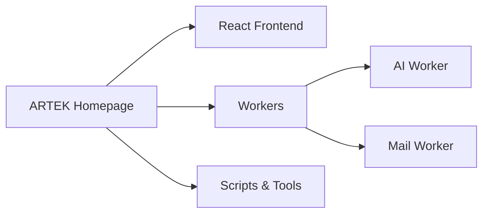
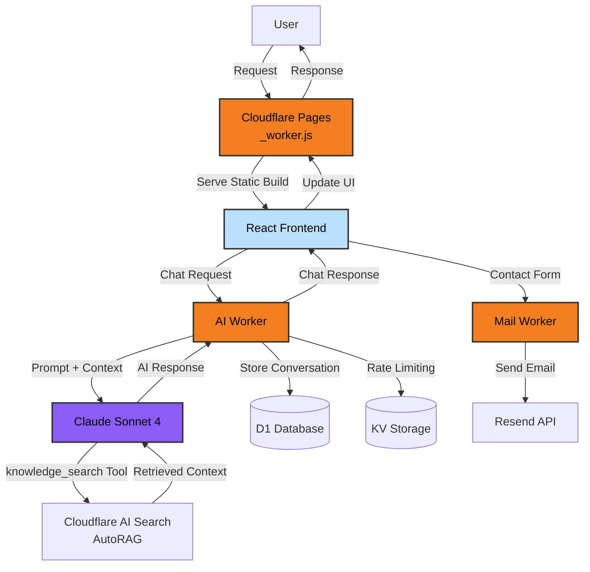

# ARTEK Homepage

[](LICENSE)
[](https://react.dev/)
[](https://www.typescriptlang.org/)
[](https://workers.cloudflare.com/)
[](https://www.anthropic.com/claude)

***ARTEK Homepage*** is a modern enterprise website project built with *React* and *Carbon Design System*, featuring multi-language support.

🌐 **Live Site:** [www.artek.tc](https://www.artek.tc)

---

## 🏗️ Architecture

The entire system runs on `Cloudflare Pages` and `Workers` in production environment.

### Three-Layer Architecture

The `ARTEK Homepage` project architecture can be explained comprehensively with three main concepts:

- **React Frontend** is the user interaction layer and manages the user interface.
- **Workers** layer consists of the system's backend services: *AI Worker* and *Mail Worker*.
- **Scripts & Tools** consists of tools supporting development and production processes.



### Data Flow & Integrations



---

## 📁 Project Structure

```
artek-homepage/
├── src/
│   ├── pages/
│   ├── shared/
│   │   ├── components/
│   │   ├── hooks/
│   │   ├── styles/
│   │   └── translations/
│   └── router/
├── workers/
│   ├── ai-worker/
│   │   ├── src/
│   │   ├── migrations/
│   │   └── wrangler.jsonc
│   └── mail-worker/
│       ├── src/
│       └── wrangler.jsonc
├── scripts/
│   ├── utils/
│   └── dashboard/
├── public/
│   └── data/
└── dist/
```

---

## 🎖️ Acknowledgments

This project would not be possible without the following amazing open source projects:

- **[React](https://react.dev/)**
- **[React Router](https://reactrouter.com/)**
- **[Carbon Design System](https://carbondesignsystem.com/)**
- **[Cloudflare Workers](https://workers.cloudflare.com/)**
- **[Claude AI](https://www.anthropic.com/claude)**
- **[Vite](https://vite.dev/)**
- **[TypeScript](https://www.typescriptlang.org/)**
- **[Vitest](https://vitest.dev/)**
- **[Playwright](https://playwright.dev/)**
- **[Ethers.js](https://docs.ethers.org/)**

---

## 🤝 Why Open Source?

Those who conceal knowledge consume it, those who share it multiply it. Throughout history, humanity's greatest leaps have occurred when ideas could flow freely. Open source is the modern expression of this ancient truth.

An idea gains strength as it spreads. It matures through criticism. It grows as contributions are added.
This project aims to be a collective work of everyone who shows the courage to share
([always open](LICENSE)) to remain open not just today but tomorrow as well.

### AGPL-3.0 License & Ethical Obligation

This project is published under the **AGPL-3.0** license. This means that everyone who forks the project or uses it in their own projects is under the **ethical obligation** to keep their source code open. AGPL, the strongest version of GPL for applications providing services over a network, guarantees the continuation of open source philosophy.

**For our contribution policy:**
Please refer to the [CONTRIBUTING.md](CONTRIBUTING.md) file. (Note: This repository does not accept external contributions.)

**For detailed license information:**
Please review the [LICENSE](LICENSE) file.

---

## 📧 Contact

**ARTEK İnovasyon Ar-Ge Sanayi ve Tic. Ltd. Şti.**

- 🌐 Website: [www.artek.tc](https://www.artek.tc)
- 📧 For General Inquiries: info@artek.tc

**Developer Contact Information:**
- 👤 Rıza Emre ARAS
- 📧 r.emrearas@proton.me

---

> *"In the world, the truest guide for everything, for civilization, for life, for success is science and technology.*
> *Seeking a guide outside of science and technology is heedlessness, ignorance, and heresy."*
>
> — **Mustafa Kemal Atatürk**, September 22, 1924, Speech to the Teachers of İstiklal Trade School in Samsun
>
> <sub>[Atatürk's Speeches and Statements, Volume II, p.349, ATAM Publications](http://atam.gov.tr/wp-content/uploads/2024/03/Ataturkun-Soylev-ve-Demecleri-C2.pdf)</sub>

---

<!--suppress HtmlDeprecatedAttribute -->
<div align="center">


</div>

---

<div align="center">

 **© 2025 Artek İnovasyon Arge Sanayi ve Ticaret Limited Şirketi, All rights reserved.**

</div>