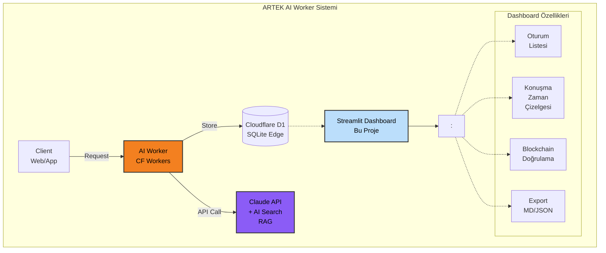

# ARTEK AI Worker Dashboard

Cloudflare D1 veritabanında saklanan AI konuşma kayıtlarını görüntülemek ve dışa aktarmak için Streamlit tabanlı analitik dashboard.

## Mimari



## Blockchain Bütünlük Sistemi

AI Worker, konuşmaları EIP-712 TypedData standardı ile kriptografik olarak imzalar.

### Çalışma Prensibi

1. **Genesis Block** - İlk mesaj yeni bir zincir başlatır (`chain_id` ethers entropy ile üretilir)
2. **Chain Linking** - Her blok, önceki bloğun hash'ini (`prev_hash`) içerir
3. **Context Hash** - O(1) performanslı context lookup için EIP-712 hash
4. **Tamper Detection** - Zincir doğrulaması ile veri manipülasyonu tespit edilir

### Veritabanı Şeması

```sql
CREATE TABLE conversation_logs (
  id                  INTEGER PRIMARY KEY AUTOINCREMENT,

  -- Blockchain Core
  chain_id            TEXT NOT NULL,     
  block_hash          TEXT NOT NULL,     
  prev_hash           TEXT,              
  block_index         INTEGER NOT NULL,  

  -- Context Lookup
  context_hash        TEXT NOT NULL,     

  -- Mesajlar
  context             TEXT NOT NULL,     
  user_message        TEXT NOT NULL,     
  assistant_response  TEXT NOT NULL,     

  -- Metadata
  locale              TEXT DEFAULT 'tr',
  ip_hash             TEXT,              
  model               TEXT NOT NULL,     
  tokens_in           INTEGER NOT NULL,
  tokens_out          INTEGER NOT NULL,
  latency_ms          INTEGER NOT NULL,
  tool_calls          TEXT,              
  created_at          INTEGER NOT NULL   
);
```

## Dashboard Özellikleri

| Özellik                  | Açıklama                                                                     |
|--------------------------|------------------------------------------------------------------------------|
| **Oturum Listesi**       | Tüm konuşma oturumlarını tarih, mesaj sayısı ve token kullanımı ile listeler |
| **IP Filtresi**          | Anonimleştirilmiş IP hash'ine göre oturumları filtreler                      |
| **Konuşma Görüntüleme**  | Chat arayüzünde soru-cevap akışını gösterir                                  |
| **Araç Kullanımı**       | knowledge_search sorgu ve sonuçlarını görüntüler                             |
| **Blockchain Doğrulama** | Seçili zincirin bütünlüğünü doğrular                                         |
| **Export (Markdown)**    | Oturumu okunabilir `.md` formatında dışa aktarır                             |
| **Export (JSON)**        | Oturumu makine tarafından okunabilir `.json` formatında dışa aktarır         |
| **Çoklu Dil**            | Türkçe / İngilizce arayüz desteği                                            |

## Hızlı Başlangıç

### 1. Ortam Değişkenleri

```bash
cd scripts/dashboard/ai-worker
cp .env.example .env
```

`workers/ai-worker/.env` dosyasından kimlik bilgilerini kopyalayın:

```env
CLOUDFLARE_API_TOKEN=your_token
CLOUDFLARE_ACCOUNT_ID=your_account_id
D1_DATABASE_ID=your_database_id
```

### 2. Bağımlılıkları Kurma

```bash
pip install -r requirements.txt
```

### 3. Dashboard'u Çalıştırma

```bash
streamlit run app.py
```

Otomatik olarak açılır: **http://localhost:8501**

## Dosya Yapısı

```
scripts/dashboard/ai-worker/
├── app.py              # Ana Streamlit uygulaması
├── db_connector.py     # Cloudflare D1 REST API bağlantısı
├── db_connector_dev.py # Geliştirme için SQLite bağlantısı
├── export_utils.py     # Markdown/JSON export fonksiyonları
├── translations.py     # i18n yardımcı fonksiyonları
├── locales/
│   ├── tr.json         # Türkçe çeviriler
│   └── en.json         # İngilizce çeviriler
└── .streamlit/
    └── config.toml     # Streamlit yapılandırması
```

## Veri Kaynağı

Dashboard, Cloudflare D1 veritabanına REST API üzerinden bağlanır:

```
https://api.cloudflare.com/client/v4/accounts/{account_id}/d1/database/{database_id}/query
```

Geliştirme modunda (`ENVIRONMENT=dev`) lokal SQLite dosyası kullanılır.