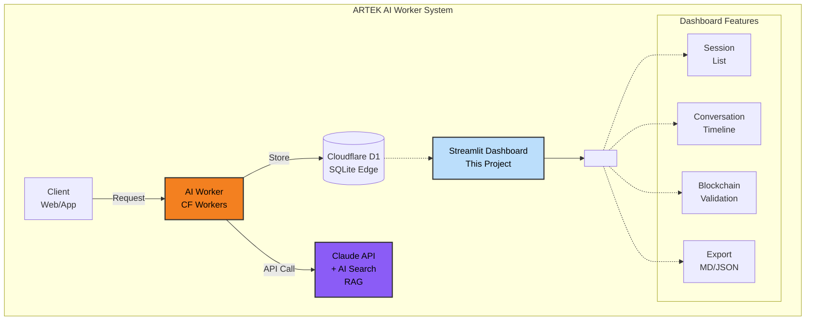

# ARTEK AI Worker Dashboard

Streamlit-based analytics dashboard for viewing and exporting AI conversation logs stored in Cloudflare D1.

## Architecture



## Blockchain Integrity System

AI Worker cryptographically signs conversations using the EIP-712 TypedData standard.

### How It Works

1. **Genesis Block** - First message starts a new chain (`chain_id` generated via ethers entropy)
2. **Chain Linking** - Each block contains the previous block's hash (`prev_hash`)
3. **Context Hash** - EIP-712 hash for O(1) performance context lookup
4. **Tamper Detection** - Chain validation detects data manipulation

### Database Schema

```sql
CREATE TABLE conversation_logs (
  id                  INTEGER PRIMARY KEY AUTOINCREMENT,

  -- Blockchain Core
  chain_id            TEXT NOT NULL,     -- Chain identifier (256-bit)
  block_hash          TEXT NOT NULL,     -- EIP-712 TypedData hash
  prev_hash           TEXT,              -- Previous block hash (genesis: null)
  block_index         INTEGER NOT NULL,  -- Sequence: 0, 1, 2...

  -- Context Lookup
  context_hash        TEXT NOT NULL,     -- Hash for O(1) lookup (UNIQUE)

  -- Messages
  context             TEXT NOT NULL,     -- Full conversation JSON
  user_message        TEXT NOT NULL,     -- User question
  assistant_response  TEXT NOT NULL,     -- AI response

  -- Metadata
  locale              TEXT DEFAULT 'tr',
  ip_hash             TEXT,              -- Anonymized IP
  model               TEXT NOT NULL,     -- Claude model name
  tokens_in           INTEGER NOT NULL,
  tokens_out          INTEGER NOT NULL,
  latency_ms          INTEGER NOT NULL,
  tool_calls          TEXT,              -- JSON array (knowledge_search etc.)
  created_at          INTEGER NOT NULL   -- Unix timestamp (ms)
);
```

## Dashboard Features

| Feature                   | Description                                                               |
|---------------------------|---------------------------------------------------------------------------|
| **Session List**          | Lists all conversation sessions with date, message count, and token usage |
| **IP Filter**             | Filters sessions by anonymized IP hash                                    |
| **Conversation View**     | Displays Q&A flow in chat interface                                       |
| **Tool Usage**            | Shows knowledge_search queries and results                                |
| **Blockchain Validation** | Validates the integrity of selected chain                                 |
| **Export (Markdown)**     | Exports session in readable `.md` format                                  |
| **Export (JSON)**         | Exports session in machine-readable `.json` format                        |
| **Multi-language**        | Turkish / English interface support                                       |

## Quick Start

### 1. Environment Variables

```bash
cd scripts/dashboard/ai-worker
cp .env.example .env
```

Copy credentials from `workers/ai-worker/.env`:

```env
CLOUDFLARE_API_TOKEN=your_token
CLOUDFLARE_ACCOUNT_ID=your_account_id
D1_DATABASE_ID=your_database_id
```

### 2. Install Dependencies

```bash
pip install -r requirements.txt
```

### 3. Run Dashboard

```bash
streamlit run app.py
```

Opens automatically: **http://localhost:8501**

## File Structure

```
scripts/dashboard/ai-worker/
├── app.py              # Main Streamlit application
├── db_connector.py     # Cloudflare D1 REST API connector
├── db_connector_dev.py # SQLite connector for development
├── export_utils.py     # Markdown/JSON export functions
├── translations.py     # i18n helper functions
├── locales/
│   ├── tr.json         # Turkish translations
│   └── en.json         # English translations
└── .streamlit/
    └── config.toml     # Streamlit configuration
```

## Data Source

Dashboard connects to Cloudflare D1 database via REST API:

```
https://api.cloudflare.com/client/v4/accounts/{account_id}/d1/database/{database_id}/query
```

In development mode (`ENVIRONMENT=dev`), a local SQLite file is used.