# Diagram to Prose

Mermaid diyagramlarını doğal dil açıklamalarına dönüştüren Claude AI tabanlı CLI aracı. RAG sistemleri ve AI anlayışı için optimize edilmiş çıktı üretir.

## Mimari

```mermaid
flowchart TB                                                                                                                                                                                                                                                                                                                                                               
  subgraph "Diagram to Prose Dönüştürücü"                                                                                                                                                                                                                                                                                                                                
      MarkdownFile[Markdown File<br/>Mermaid] -- Input --> CLI[Node.js CLI<br/>Tool]                                                                                                                                                                                                                                                                                     
      CLI -- API Request --> Claude[Claude API<br/>Sonnet 4.5]                                                                                                                                                                                                                                                                                                           
                                                                                                                                                                                                                                                                                                                                                                         
      CLI -.-> SystemPrompt[System Prompt<br/>RAG Optimized]                                                                                                                                                                                                                                                                                                             
                                                                                                                                                                                                                                                                                                                                                                         
      Claude -- Process --> NLP[Natural Lang.<br/>Processing]                                                                                                                                                                                                                                                                                                            
                                                                                                                                                                                                                                                                                                                                                                         
      NLP -- Generate --> Output[Output: .prose.md Dosyası]                                                                                                                                                                                                                                                                                                              
                                                                                                                                                                                                                                                                                                                                                                         
      subgraph "Çıktı Özellikleri"                                                                                                                                                                                                                                                                                                                                       
          StepByStep[Adım Adım<br/>Açıklama]                                                                                                                                                                                                                                                                                                                             
          KeywordRepeat[Keyword<br/>Tekrarı]                                                                                                                                                                                                                                                                                                                             
          IndependentSentences[Bağımsız Cümleler<br/>RAG için]                                                                                                                                                                                                                                                                                                           
      end                                                                                                                                                                                                                                                                                                                                                                
                                                                                                                                                                                                                                                                                                                                                                         
      Output --> OutputFeatures[":"]                                                                                                                                                                                                                                                                                                                                     
      OutputFeatures -.-> StepByStep                                                                                                                                                                                                                                                                                                                                     
      OutputFeatures -.-> KeywordRepeat                                                                                                                                                                                                                                                                                                                                  
      OutputFeatures -.-> IndependentSentences                                                                                                                                                                                                                                                                                                                           
  end                                                                                                                                                                                                                                                                                                                                                                    
                                                                                                                                                                                                                                                                                                                                                                         
  style CLI fill:#BBDEFB,stroke:#333,stroke-width:2px,color:#000000                                                                                                                                                                                                                                                                                                      
  style Claude fill:#8B5CF6,stroke:#333,stroke-width:2px,color:#000000                                                                                                                                                                                                                                                                                                   
  style Output fill:#C8E6C9,stroke:#333,stroke-width:2px,color:#000000 
```



## Dönüştürme Stratejisi

Araç, diyagramları RAG sistemleri için optimize edilmiş doğal dil açıklamalarına dönüştürür:

### Çalışma Prensibi

1. **Dil Algılama** - Diyagram etiketlerinden dil otomatik olarak algılanır (Türkçe/İngilizce)
2. **Yapı Analizi** - Tüm node'lar, edge'ler ve ilişkiler çıkarılır
3. **Cümle Üretimi** - Her cümle bağımsız ve anahtar kelime bakımından zengin üretilir
4. **RAG Optimizasyonu** - Önemli terimler her cümlede tekrarlanır (O(1) retrieval)

### Desteklenen Diyagram Türleri

| Diyagram Türü       | Mermaid Syntax          | Açıklama                                              |
|---------------------|-------------------------|-------------------------------------------------------|
| **Akış Diyagramı**  | `flowchart TB/LR/TD/BT` | Süreç adımlarını numaralandırılmış listeye dönüştürür |
| **Sıralı Diyagram** | `sequenceDiagram`       | Etkileşimleri anlatım formatına dönüştürür            |
| **Durum Diyagramı** | `stateDiagram-v2`       | Durum geçişlerini açıklamalara dönüştürür             |
| **Sınıf Diyagramı** | `classDiagram`          | Sınıf ilişkilerini açıklamalara dönüştürür            |

## Özellikler

| Özellik                   | Açıklama                                                                  |
|---------------------------|---------------------------------------------------------------------------|
| **Otomatik Dil Algılama** | Diyagram etiketlerinden dili algılar ve aynı dilde çıktı üretir           |
| **RAG Optimizasyonu**     | Her cümle bağımsız ve anahtar kelime bakımından zengindir                 |
| **Keyword Tekrarı**       | Önemli terimler her cümlede tekrarlanarak retrieval performansı artırılır |
| **Tam Kapsama**           | Diyagramdaki tüm elementler (node, edge, decision) çıktıda yer alır       |
| **CLI Aracı**             | Global olarak kurulabilir ve herhangi bir dizinden çalıştırılabilir       |
| **Maliyet Raporu**        | Token kullanımı ve API maliyeti gösterilir                                |
| **Claude Sonnet 4.5**     | En güncel Claude modeli ile yüksek kaliteli çıktı                         |

## Hızlı Başlangıç

### 1. Kurulum

```bash
cd scripts/tools/diagram-to-prose
npm install
```

### 2. Ortam Değişkenleri

```bash
cp .env.example .env
```

`.env` dosyasını düzenleyip Claude API anahtarınızı ekleyin:

```env
CLAUDE_API_KEY=sk-ant-api03-xxxxx
```

API anahtarı almak için: https://console.anthropic.com/

### 3. Global Kullanım (İsteğe Bağlı)

```bash
npm link
```

Bu komut sonrasında `diagram-to-prose` komutu sistemde her yerden kullanılabilir hale gelir.

### 4. Kullanım

**Lokal olarak:**
```bash
node index.js /path/to/diagram.md
```

**Global kurulum sonrası:**
```bash
diagram-to-prose /path/to/diagram.md
```

**Yardım görüntüleme:**
```bash
diagram-to-prose --help
```

## Dosya Yapısı

```
scripts/tools/diagram-to-prose/
├── index.js              # Ana CLI uygulaması
├── package.json          # Node.js proje yapılandırması
├── .env.example          # Ortam değişkenleri şablonu
├── .env                  # API anahtarları 
└── prompts/
    └── mermaid-to-prose.md  # Claude system prompt (RAG optimizasyonlu)
```

## Kullanım Örnekleri

### Örnek 1: Basit Akış Diyagramı

**Input dosyası (flow.md):**
```markdown
flowchart TB
A[Başlangıç] --> B[İşlem 1]
B --> C{Karar}
C -->|Evet| D[Sonuç A]
C -->|Hayır| E[Sonuç B]
```

**Komut:**
```bash
diagram-to-prose flow.md
```

**Output dosyası (flow.prose.md):**
```
Süreç şu adımlardan oluşur:

1. Süreç, Başlangıç aşamasıyla başlar.
2. Başlangıç aşamasından sonra İşlem 1 aşamasına geçilir.
3. İşlem 1 aşamasında Karar değerlendirmesi yapılır.
4. Karar değerlendirmesi olumlu ise (Evet), Sonuç A aşamasına geçilir.
5. Karar değerlendirmesi olumsuz ise (Hayır), Sonuç B aşamasına geçilir.
```

### Örnek 2: Çoklu Dosya İşleme

```bash
# Tüm diyagramları dönüştür
for file in docs/diagrams/*.md; do
  diagram-to-prose "$file"
done
```

## RAG Optimizasyon Kuralları

Araç, çıktısını RAG sistemleri için optimize eder:

1. **Keyword Yoğunluğu:** Anahtar terimler (süreç adı, aşama isimleri) her cümlede tekrarlanır
2. **Açık Referanslar:** Zamirler yerine tam isimler kullanılır
3. **Bağımsız Cümleler:** Her cümle retrieval için tek başına anlamlıdır
4. **İmplicit Bilgi Yok:** Tüm ilişkiler açıkça belirtilir
5. **Doğal Dil:** Teknik diyagram syntax'ı çıktıda kullanılmaz

## Maliyet ve Performans

| Model                | Input Fiyat       | Output Fiyat      | Ortalama Maliyet/Diyagram |
|----------------------|-------------------|-------------------|---------------------------|
| Claude Sonnet 4.5    | $3.00 / 1M token  | $15.00 / 1M token | $0.02 - $0.05             |

**Performans:**
- Ortalama yanıt süresi: 2-5 saniye
- Tipik diyagram boyutu: 500-2000 karakter
- Token kullanımı: 500-1500 input, 300-1000 output

## Geliştirme Notları

### Model Yapılandırması

Model ID ve fiyatlandırma `index.js` dosyasında tanımlıdır:

```javascript
const MODEL = {
  id: 'claude-sonnet-4-5-20250929',
  name: 'Claude Sonnet 4.5',
  inputPrice: 3.0,
  outputPrice: 15.0,
};
```

### Prompt Özelleştirme

System prompt `prompts/mermaid-to-prose.md` dosyasında bulunur. RAG optimizasyonu ve dil şablonları bu dosyada tanımlıdır.

## Sorun Giderme

### API Anahtarı Hatası
```
[DIAGRAM-TO-PROSE] CLAUDE_API_KEY is not set
```
**Çözüm:** `.env` dosyasında `CLAUDE_API_KEY` değişkenini ayarlayın.

### Dosya Bulunamadı
```
[DIAGRAM-TO-PROSE] Input file not found: /path/to/file.md
```
**Çözüm:** Dosya yolunun doğru olduğundan emin olun.

### Rate Limit
```
[DIAGRAM-TO-PROSE] Rate limited. Please wait and try again.
```
**Çözüm:** API rate limit'ine ulaştınız, birkaç dakika bekleyin.