# Diagram to Prose

Claude AI-powered CLI tool that converts Mermaid diagrams into natural language descriptions. Produces output optimized for RAG systems and AI comprehension.

## Architecture

```mermaid
flowchart TB                                                                                                                                                                                                                                                                                                                                                               
      subgraph "Diagram to Prose Converter"                                                                                                                                                                                                                                                                                                                                  
          MarkdownFile[Markdown File<br/>Mermaid] -- Input --> CLI[Node.js CLI<br/>Tool]                                                                                                                                                                                                                                                                                     
          CLI -- API Request --> Claude[Claude API<br/>Sonnet 4.5]                                                                                                                                                                                                                                                                                                           
                                                                                                                                                                                                                                                                                                                                                                             
          CLI -.-> SystemPrompt[System Prompt<br/>RAG Optimized]                                                                                                                                                                                                                                                                                                             
                                                                                                                                                                                                                                                                                                                                                                             
          Claude -- Process --> NLP[Natural Lang.<br/>Processing]                                                                                                                                                                                                                                                                                                            
                                                                                                                                                                                                                                                                                                                                                                             
          NLP -- Generate --> Output[Output: .prose.md File]                                                                                                                                                                                                                                                                                                                 
                                                                                                                                                                                                                                                                                                                                                                             
          subgraph "Output Features"                                                                                                                                                                                                                                                                                                                                         
              StepByStep[Step-by-Step<br/>Description]                                                                                                                                                                                                                                                                                                                       
              KeywordRepeat[Keyword<br/>Repetition]                                                                                                                                                                                                                                                                                                                          
              IndependentSentences[Independent Sentences<br/>for RAG]                                                                                                                                                                                                                                                                                                        
          end                                                                                                                                                                                                                                                                                                                                                                
                                                                                                                                                                                                                                                                                                                                                                             
          Output --> OutputFeatures[":"]                                                                                                                                                                                                                                                                                                                                     
          OutputFeatures -.-> StepByStep                                                                                                                                                                                                                                                                                                                                     
          OutputFeatures -.-> KeywordRepeat                                                                                                                                                                                                                                                                                                                                  
          OutputFeatures -.-> IndependentSentences                                                                                                                                                                                                                                                                                                                           
      end                                                                                                                                                                                                                                                                                                                                                                    
                                                                                                                                                                                                                                                                                                                                                                             
      style CLI fill:#BBDEFB,stroke:#333,stroke-width:2px,color:#000000                                                                                                                                                                                                                                                                                                      
      style Claude fill:#8B5CF6,stroke:#333,stroke-width:2px,color:#000000                                                                                                                                                                                                                                                                                                   
      style Output fill:#C8E6C9,stroke:#333,stroke-width:2px,color:#000000 
```



## Conversion Strategy

The tool converts diagrams into natural language descriptions optimized for RAG systems:

### How It Works

1. **Language Detection** - Automatically detects language from diagram labels (Turkish/English)
2. **Structure Analysis** - Extracts all nodes, edges, and relationships
3. **Sentence Generation** - Each sentence is generated independently and keyword-rich
4. **RAG Optimization** - Key terms are repeated in each sentence (O(1) retrieval)

### Supported Diagram Types

| Diagram Type           | Mermaid Syntax          | Description                                           |
|------------------------|-------------------------|-------------------------------------------------------|
| **Flowchart**          | `flowchart TB/LR/TD/BT` | Converts process steps into numbered list             |
| **Sequence Diagram**   | `sequenceDiagram`       | Converts interactions into narrative format           |
| **State Diagram**      | `stateDiagram-v2`       | Converts state transitions into descriptions          |
| **Class Diagram**      | `classDiagram`          | Converts class relationships into descriptions        |

## Features

| Feature                          | Description                                                                    |
|----------------------------------|--------------------------------------------------------------------------------|
| **Automatic Language Detection** | Detects language from diagram labels and generates output in same language     |
| **RAG Optimization**             | Each sentence is independent and keyword-rich                                  |
| **Keyword Repetition**           | Important terms are repeated in each sentence to improve retrieval performance |
| **Full Coverage**                | All diagram elements (nodes, edges, decisions) are included in output          |
| **CLI Tool**                     | Can be installed globally and run from any directory                           |
| **Cost Reporting**               | Shows token usage and API cost                                                 |
| **Claude Sonnet 4.5**            | High-quality output with the latest Claude model                               |

## Quick Start

### 1. Installation

```bash
cd scripts/tools/diagram-to-prose
npm install
```

### 2. Environment Variables

```bash
cp .env.example .env
```

Edit `.env` file and add your Claude API key:

```env
CLAUDE_API_KEY=sk-ant-api03-xxxxx
```

Get API key from: https://console.anthropic.com/

### 3. Global Usage (Optional)

```bash
npm link
```

After this command, `diagram-to-prose` command becomes available system-wide.

### 4. Usage

**Locally:**
```bash
node index.js /path/to/diagram.md
```

**After global installation:**
```bash
diagram-to-prose /path/to/diagram.md
```

**Show help:**
```bash
diagram-to-prose --help
```

## File Structure

```
scripts/tools/diagram-to-prose/
├── index.js              # Main CLI application
├── package.json          # Node.js project configuration
├── .env.example          # Environment variables template
├── .env                  # API keys
└── prompts/
    └── mermaid-to-prose.md  # Claude system prompt (RAG optimized)
```

## Usage Examples

### Example 1: Simple Flowchart

**Input file (flow.md):**
```markdown
flowchart TB
A[Start] --> B[Process 1]
B --> C{Decision}
C -->|Yes| D[Result A]
C -->|No| E[Result B]
```

**Command:**
```bash
diagram-to-prose flow.md
```

**Output file (flow.prose.md):**
```
The process consists of the following steps:

1. The process begins with the Start phase.
2. After the Start phase, the process moves to the Process 1 phase.
3. In the Process 1 phase, a Decision evaluation is performed.
4. If the Decision evaluation is positive (Yes), the process moves to the Result A phase.
5. If the Decision evaluation is negative (No), the process moves to the Result B phase.
```

### Example 2: Batch Processing

```bash
# Convert all diagrams
for file in docs/diagrams/*.md; do
  diagram-to-prose "$file"
done
```

## RAG Optimization Rules

The tool optimizes output for RAG systems:

1. **Keyword Density:** Key terms (process name, phase names) are repeated in each sentence
2. **Explicit References:** Full names are used instead of pronouns
3. **Independent Sentences:** Each sentence works standalone for retrieval
4. **No Implicit Knowledge:** All relationships are explicitly stated
5. **Natural Language:** Technical diagram syntax is not used in output

## Cost and Performance

| Model                | Input Price       | Output Price      | Average Cost/Diagram |
|----------------------|-------------------|-------------------|----------------------|
| Claude Sonnet 4.5    | $3.00 / 1M token  | $15.00 / 1M token | $0.02 - $0.05        |

**Performance:**
- Average response time: 2-5 seconds
- Typical diagram size: 500-2000 characters
- Token usage: 500-1500 input, 300-1000 output

## Development Notes

### Model Configuration

Model ID and pricing are defined in `index.js`:

```javascript
const MODEL = {
  id: 'claude-sonnet-4-5-20250929',
  name: 'Claude Sonnet 4.5',
  inputPrice: 3.0,
  outputPrice: 15.0,
};
```

### Prompt Customization

System prompt is located in `prompts/mermaid-to-prose.md`. RAG optimization and language templates are defined in this file.

## Troubleshooting

### API Key Error
```
[DIAGRAM-TO-PROSE] CLAUDE_API_KEY is not set
```
**Solution:** Set `CLAUDE_API_KEY` variable in `.env` file.

### File Not Found
```
[DIAGRAM-TO-PROSE] Input file not found: /path/to/file.md
```
**Solution:** Make sure the file path is correct.

### Rate Limit
```
[DIAGRAM-TO-PROSE] Rate limited. Please wait and try again.
```
**Solution:** You've reached the API rate limit, wait a few minutes.