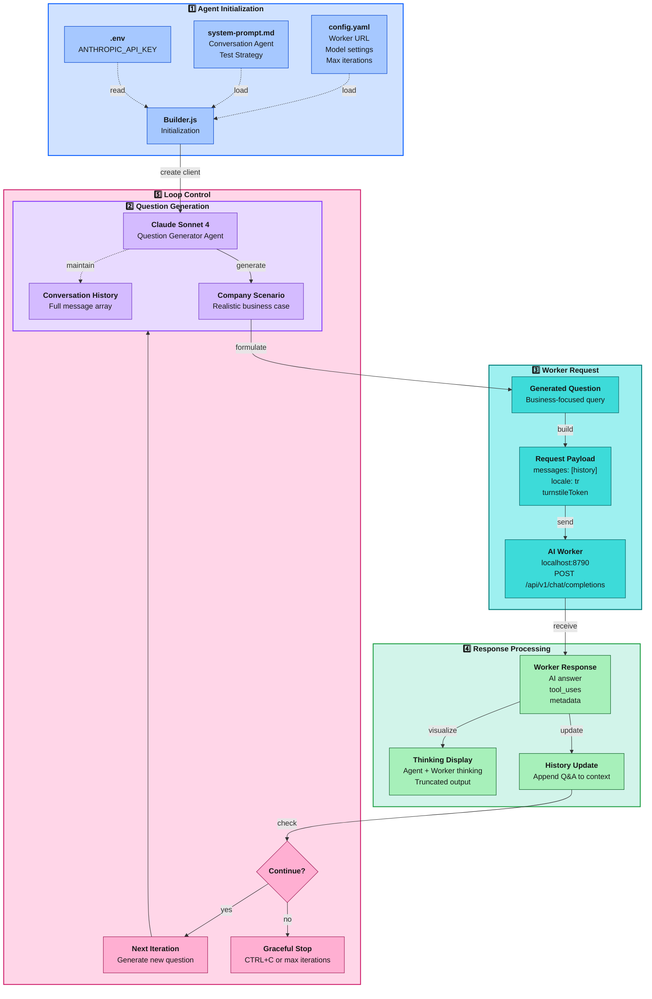

# Dynamic Conversation Builder - AI Worker Stress Testing

Dynamic Conversation Builder aracı, Claude AI kullanarak geliştirme ortamında çalışan AI Worker üzerinde otonom bir konuşma
akışı başlatır. Araç, döngü tamamlanana kadar sistem komutunuzu baz alarak sorular üretir, AI Worker'a gönderir. Bu sayede 
bilgi bankası retrieval kalitesi, yanıt doğruluğu ve edge case yönetimi görsel olarak test edilebilir.

## Mimari



## Çalışma Prensibi

Dynamic Conversation Builder süreci beş aşamadan oluşur:

### 1. Agent Initialization

**builder.js** başlatıldığında:
- `config.yaml` yüklenir (worker URL, model, max iterations)
- `system-prompt.md` okunur (conversation agent strategy)
- `.env` dosyasından `ANTHROPIC_API_KEY` alınır
- Anthropic SDK client oluşturulur

### 2. Question Generation

**Claude Sonnet 4** (question generator agent) şunları yapar:
- Gerçekçi şirket senaryosu oluşturur (sektör, büyüklük, zorluklar)
- Conversation history'yi analiz eder
- Stress testing stratejisine göre soru üretir:
  - Edge case sorgulamaları (ARTEK'in kendine Ar-Ge merkezi var mı?)
  - Sentez gerektiren sorular (istatistik + süreç + tavsiye)
  - Spesifik senaryo bazlı (18 mühendis, 85 çalışan - yeterli mi?)
- Full conversation history ile çalışır (frontend gibi)

### 3. Worker Request

Üretilen soru AI Worker'a gönderilir:

```javascript
POST http://localhost:8790/api/v1/chat/completions

{
  "messages": [
    { "role": "user", "content": "Soru 1" },
    { "role": "assistant", "content": "Cevap 1" },
    { "role": "user", "content": "Soru 2" }  // Yeni soru
  ],
  "locale": "tr",
  "turnstileToken": "XXXX.DUMMY.TOKEN.XXXX"
}
```

### 4. Response Processing

Worker yanıtı işlenir:
- **Thinking Display**: Hem agent'ın hem worker'ın thinking süreçleri terminal'de gösterilir
- **Truncated Output**: Terminal için optimize edilmiş (150/300/200 char limits)
- **Tool Use Tracking**: `knowledge_search` sorguları ve sonuçları görselleştirilir
- **History Update**: Soru-cevap conversation history'ye eklenir

### 5. Loop Control

Döngü kontrolü:
- **CTRL+C**: Graceful shutdown (mevcut sorgu bittikten sonra durur)
- **Max Iterations**: config.yaml'da belirtilen limite ulaşınca durur (örn: 100)
- **Error Handling**: Worker'dan validation error gelirse durur
- **Continue**: Yukarıdaki durumlar yoksa 2. aşamaya dön

## Desteklenen Yapılandırmalar

| Parametre                | Değer                      | Açıklama                                  |
|--------------------------|----------------------------|-------------------------------------------|
| **Worker URL**           | `localhost:8790`           | AI Worker endpoint                        |
| **Model**                | `claude-sonnet-4`          | Question generator model                  |
| **Max Iterations**       | `100` (varsayılan)         | Otomatik durdurma limiti                  |
| **Locale**               | `tr`                       | Soru dili                                 |
| **Thinking Enabled**     | `true`                     | Claude extended thinking göster           |
| **Color Output**         | `true`                     | ANSI renkleri ile terminal output         |
| **Turnstile Token**      | `XXXX.DUMMY.TOKEN.XXXX`    | Dev ortamı için dummy token               |

## Özellikler

| Özellik                       | Açıklama                                                                  |
|-------------------------------|---------------------------------------------------------------------------|
| **Autonomous Conversation**   | Claude kendisi soru üretiyor, worker'dan cevap alıyor                     |
| **Stress Testing**            | Edge case'ler, complex scenarios, retrieval accuracy testing              |
| **Realistic Scenarios**       | Gerçekçi şirket profilleri ve ihtiyaçları simüle eder                     |
| **Terminal-Only Output**      | Log dosyası oluşturmaz, sadece real-time terminal display                 |
| **Graceful Shutdown**         | CTRL+C ile mevcut sorgu bittikten sonra durur                             |
| **Full History**              | Frontend gibi full message history gönderir                                |
| **Thinking Visualization**    | Hem agent'ın hem worker'ın thinking süreçlerini gösterir                  |
| **Truncated Display**         | Terminal için optimize edilmiş output (150/300/200 char limits)           |
| **Tool Use Tracking**         | `knowledge_search` sorguları ve sonuçlarını görselleştirir                |
| **Error Detection**           | Worker validation hatalarında otomatik durdurma                            |

## Hızlı Başlangıç

### Ön Gereksinimler

```bash
# 1. Node.js bağımlılıkları (project root'ta)
npm install

# 2. AI Worker çalışıyor olmalı (localhost:8790)
cd workers/ai-worker
npm run dev
```

### Adım Adım Kullanım

#### 1. Ortam Değişkenleri

```bash
cd scripts/utils/dynamic-conversation-builder
cp .env.example .env
```

`.env` dosyasını düzenleyip Claude API anahtarınızı ekleyin:

```env
ANTHROPIC_API_KEY=sk-ant-api03-xxxxx
```

API anahtarı almak için: https://console.anthropic.com/

#### 2. AI Worker'ı Başlatma

**Terminal 1:**
```bash
cd workers/ai-worker
npm run dev

# Beklenen output:
# [wrangler] Ready on http://localhost:8790
```

#### 3. Conversation Builder'ı Çalıştırma

**Terminal 2:**
```bash
cd scripts/utils/dynamic-conversation-builder
node builder.js
```

**Beklenen Output:**

```
━━━━━━━━━━━━━━━━━━━━━━━━━━━━━━━━━━━━━━━━━━━━━━━━━━━━━━━━━━━━━━━━━━━━━━━━
Dynamic Conversation Builder - ARTEK AI Worker Stress Testing
━━━━━━━━━━━━━━━━━━━━━━━━━━━━━━━━━━━━━━━━━━━━━━━━━━━━━━━━━━━━━━━━━━━━━━━━

[CONFIG] Worker: http://localhost:8790/api/v1/chat/completions
[CONFIG] Model: claude-sonnet-4-20250514
[CONFIG] Max iterations: 100
[CONFIG] Locale: tr
[CONFIG] Thinking enabled: ✓
[CONFIG] Color output: ✓

━━━━━━━━━━━━━━━━━━━━━━━━━━━━━━━━━━━━━━━━━━━━━━━━━━━━━━━━━━━━━━━━━━━━━━━━

[MESSAGE 1] AGENT → WORKER

[AGENT THINKING]
Şirket senaryosu oluşturacağım: Bursa'da otomotiv yan sanayii, 85 çalışan, 18 mühendis...

[USER MESSAGE]
Merhaba, Bursa'da otomotiv yan sanayiinde faaliyet gösteren bir şirketin Ar-Ge müdürüyüm...

[WORKER REQUEST] POST http://localhost:8790/api/v1/chat/completions
[WORKER RESPONSE] 200 OK (5.2s)

[WORKER THINKING]
Kullanıcı ARTEK'in hizmetlerini öğrenmek istiyor. knowledge_search ile bilgi alacağım...

[ASSISTANT RESPONSE]
ARTEK, Ar-Ge ve inovasyon alanında danışmanlık hizmeti veren bir şirkettir...
(Token: 1250 input, 850 output, 2100 total)

━━━━━━━━━━━━━━━━━━━━━━━━━━━━━━━━━━━━━━━━━━━━━━━━━━━━━━━━━━━━━━━━━━━━━━━━

[MESSAGE 2] AGENT → WORKER

[AGENT THINKING]
Şimdi edge case soracağım: ARTEK'in kendi Ar-Ge merkezi var mı?...

[USER MESSAGE]
Anladım. ARTEK'in kendi Ar-Ge merkezi var mı?

...
```

#### 4. Durdurma

**Graceful Stop (Önerilen):**
```bash
CTRL+C  # Mevcut sorgu bittikten sonra durur
```

**Force Stop:**
```bash
CTRL+C + CTRL+C  # Hemen durur
```

## Dosya Yapısı

```
scripts/utils/dynamic-conversation-builder/
├── builder.js              # Ana conversation loop
├── config.yaml             # Yapılandırma (worker URL, model, iterations)
├── system-prompt.md        # Conversation agent system prompt
├── .env.example            # Environment template
├── .env                    # API keys (not committed)
└── README.md               # Bu dosya
```

## Yapılandırma Dosyaları

### config.yaml

```yaml
# Worker configuration
worker:
  url: http://localhost:8790/api/v1/chat/completions
  turnstile_token: XXXX.DUMMY.TOKEN.XXXX  # Dummy token for dev testing
  locale: tr

# Conversation agent configuration
conversation_agent:
  model: claude-sonnet-4-20250514
  max_iterations: 100           # Auto-stop after N messages
  thinking_enabled: true

# Output configuration
output:
  show_thinking: true
  color_enabled: true
```

### system-prompt.md

Conversation agent'ın test stratejisini tanımlar:

**Soru Kategorileri:**
- ARTEK'in rolü ve hizmet kapsamı (30%)
- Ar-Ge vs Tasarım merkezi farkları (20%)
- Başvuru süreçleri ve gereksinimler (25%)
- Pratik kaygılar (maliyet, süre, risk) (25%)

**Soru Türleri:**
- Geniş keşif: "ARTEK nedir?"
- Spesifik bilgi: "Minimum kaç personel gerekir?"
- Edge case: "ARTEK'in kendi Ar-Ge merkezi var mı?"
- Kompleks senaryo: "12 mühendis, 8 tekniker - yeterli mi?"
- Multi-hop sentez: "İstanbul istatistikleri + ARTEK'in rolü + tavsiyeler"

## Test Stratejisi

### Stress Testing Hedefleri

1. **Retrieval Doğruluğunu Zorla**
   - 2-3 `knowledge_search` gerektiren kompleks sorular
   - Birden fazla veri kaynağının sentezlenmesi gereken sorular

2. **Edge Case'leri Sorgula**
   - "ARTEK'in Ar-Ge merkezi var mı?" → HAYIR, danışmanlık firması
   - "Ar-Ge merkezi olmadan TÜBİTAK desteği alınabilir mi?" → EVET, proje bazlı
   - "ARTEK muhasebe/vergi danışmanlığı da veriyor mu?" → HAYIR, sadece teknik

3. **Sentez Gerektiren Sorular**
   - İstatistik + süreç + teşvik bilgilerini birleştir
   - Sektörel dağılım + spesifik şirket tavsiyeleri
   - Bölgesel analiz + başvuru timeline'ı

4. **Kaynak Doğrulama**
   - Yanıtların route referansları içerip içermediğini gözlemle
   - Sayıların tutarlılığını kontrol et

### Conversation Flow Kalıbı

**Açılış (Turn 1-2):**
- Şirket profili tanıt (sektör, büyüklük)
- Geniş hizmet sorgusu

**Derinleşme (Turn 3-5):**
- Spesifik süreç soruları
- Personel/bütçe kriterleri

**Edge Case Test (Turn 6-8):**
- ARTEK'in kendi Ar-Ge merkezi var mı?
- Danışmanlık zorunlu mu?
- Ar-Ge merkezi olmadan destek alınabilir mi?

**Kompleks Senaryo (Turn 9-12):**
- "18 mühendis, 85 çalışan, otomotiv sektörü - Ar-Ge merkezi kurabilir miyiz?"
- "Geçen yıl TÜBİTAK 1501 reddedildi, ARTEK revize sürecinde nasıl destek verir?"

**Sentez (Turn 13-15):**
- İstatistik + tavsiye + timeline kombinasyonları
- Çoklu knowledge_search gerektiren sorular

## Performance ve Optimizasyon

### Tipik Senaryo Metrikleri

| Metrik                       | Değer            | Açıklama                          |
|------------------------------|------------------|-----------------------------------|
| **Ortalama Question Time**   | 2-4 saniye       | Claude question generation        |
| **Ortalama Worker Response** | 3-5 saniye       | AI Worker (Claude + RAG)          |
| **Total Turn Time**          | 5-9 saniye       | Question + Worker response        |
| **Max Iterations**           | 100 (default)    | Otomatik durdurma limiti          |
| **Total Test Duration**      | ~10-15 dakika    | 100 iteration için                |

### Token Kullanımı

**Question Generator (Claude Sonnet 4):**
- Input: 1000-2000 tokens (system prompt + history)
- Output: 100-300 tokens (question)
- Maliyet: ~$0.003-0.007 per turn

**AI Worker (Claude Sonnet 4 + RAG):**
- Input: 1500-3000 tokens (system prompt + knowledge_search results)
- Output: 500-1500 tokens (answer)
- Maliyet: ~$0.015-0.045 per turn

**Total Maliyet (100 iterations):**
- Question Generator: ~$0.30-0.70
- AI Worker: ~$1.50-4.50
- **Toplam: ~$1.80-5.20**

### Optimizasyon Önerileri

#### 1. Max Iterations Ayarlama

```yaml
# Kısa test için
conversation_agent:
  max_iterations: 20  # 100 → 20

# Uzun stress test için
conversation_agent:
  max_iterations: 500  # 100 → 500
```

#### 2. Thinking Display Kapatma

```yaml
# Performans için
output:
  show_thinking: false  # Terminal output azalır
```

#### 3. Worker Timeout Ayarları

```javascript
// builder.js içinde
const WORKER_TIMEOUT = 30000;  // 30 saniye (default)
const WORKER_TIMEOUT = 60000;  // 60 saniye (yavaş RAG için)
```

## Kullanım Senaryoları

### Senaryo 1: Hızlı Smoke Test

```bash
# 10 mesaj ile hızlı test
# config.yaml
conversation_agent:
  max_iterations: 10

node builder.js
```

### Senaryo 2: Uzun Stress Test (Gece Boyunca)

```bash
# 500 mesaj ile yoğun test
# config.yaml
conversation_agent:
  max_iterations: 500

# Terminal output dosyaya yönlendir
node builder.js > stress-test-$(date +%Y%m%d-%H%M%S).log 2>&1 &
```

### Senaryo 3: Edge Case Odaklı Test

```bash
# system-prompt.md'yi düzenle:
# Edge case ağırlığını %50'ye çıkar

node builder.js
```

### Senaryo 4: Sentez Soruları Testi

```bash
# system-prompt.md'yi düzenle:
# Sentez soruları ağırlığını %50'ye çıkar

node builder.js
```

## Sorun Giderme

### API Key Hatası

```
[ERROR] ANTHROPIC_API_KEY or CLAUDE_API_KEY environment variable is required
```

**Çözüm:** `.env` dosyasında API key'i ayarlayın:
```bash
cp .env.example .env
# .env içine ANTHROPIC_API_KEY=sk-ant-api03-xxxxx
```

### Worker Connection Failed

```
[ERROR] Failed to connect to worker: ECONNREFUSED
```

**Çözüm:** AI Worker'ın çalıştığından emin olun:
```bash
cd workers/ai-worker
npm run dev

# http://localhost:8790 açık olmalı
```

### Worker Timeout

```
[ERROR] Worker request timeout (30000ms)
```

**Çözüm:** Timeout değerini artırın veya worker'ı kontrol edin:
```javascript
// builder.js içinde timeout değerini artır
const WORKER_TIMEOUT = 60000;  // 30000 → 60000
```

### Invalid Turnstile Token

```
[ERROR] Worker validation failed: Invalid turnstile token
```

**Çözüm:** Dev ortamında dummy token yeterli. Production worker'a karşı test ediyorsanız, geçerli bir token kullanın:
```yaml
# config.yaml
worker:
  turnstile_token: your_valid_token_here
```

### Rate Limiting

```
[ERROR] Worker returned 429: Rate limit exceeded
```

**Çözüm:** Iteration aralığına delay ekleyin:
```javascript
// builder.js içinde her iteration sonrası
await new Promise(resolve => setTimeout(resolve, 1000));  // 1 saniye bekleme
```

### Max Iterations Reached Too Quickly

```
[INFO] Max iterations (100) reached, stopping
```

**Çözüm:** Limiti artırın:
```yaml
# config.yaml
conversation_agent:
  max_iterations: 500  # 100 → 500
```

## Geliştirme Notları

### Debug Mode

Terminal output'u detaylı görmek için:

1. **Thinking Display Açık Tut:**
    ```yaml
    output:
      show_thinking: true
    ```

2. **Console Log Ekle:**
    ```javascript
    // builder.js içinde debug için
    console.log('[DEBUG] Full worker response:', JSON.stringify(response, null, 2));
    ```

3. **Tek Iteration Test:**
    ```yaml
    conversation_agent:
      max_iterations: 1
    ```

### System Prompt Özelleştirme

`system-prompt.md` dosyasını düzenleyerek test stratejisini değiştirebilirsiniz:

**Örnek: Edge Case Ağırlığını Artırma**

```markdown
### Soru Kategorileri (Ağırlıklı)

- Edge Case'ler (50%)  # 25% → 50%
- ARTEK'in rolü ve hizmet kapsamı (20%)  # 30% → 20%
- Başvuru süreçleri (15%)  # 25% → 15%
- Pratik kaygılar (15%)  # 25% → 15%
```

### Worker URL Değiştirme

Production worker'a karşı test etmek için:

```yaml
# config.yaml
worker:
  url: https://api.artek.tc/api/v1/chat/completions
  turnstile_token: your_production_token
```

### Conversation History İnceleme

Builder çalışırken full history bellekte tutulur. History'yi görmek için:

```javascript
// builder.js içinde her iteration sonrası
console.log('[DEBUG] Conversation history:',
  JSON.stringify(conversationHistory, null, 2));
```

### Custom Test Senaryoları

`system-prompt.md` içinde şirket senaryolarını özelleştirebilirsiniz:

```markdown
**Örnek senaryolar:**
- "İstanbul'da fintech startup'ı, 25 yazılımcı"
- "Ankara'da siber güvenlik şirketi, blockchain projesi"
- "İzmir'de medikal cihaz üretimi, 150 çalışan"
```

## Conversation Agent Karakteri

Conversation agent şu roller üstlenir:

**Pozisyon:** Ar-Ge Müdürü, Genel Müdür, Proje Yöneticisi

**Şirket Profilleri:**
- Sektör: Savunma, otomotiv, yazılım, elektronik, makine, kimya, tekstil, gıda
- Büyüklük: KOBİ (50-250 çalışan) veya büyük işletme (250+ çalışan)

**Mevcut Durum:**
- Ar-Ge merkezi kurmayı planlıyor
- Tasarım merkezi başvurusu düşünüyor
- TÜBİTAK/KOSGEB projesi hazırlıyor
- Önceki başvuru reddedildi, revize etmek istiyor

**Spesifik Zorluklar:**
- Bütçe kısıtları
- Personel sayısı sınırda (örn: 12 mühendis, 15 FTE şartı var)
- Mevzuat belirsizlikleri
- Timeline baskısı (yönetim kurulu 3-6 ay içinde karar bekliyor)

## İleri Seviye Kullanım

### Log Analizi için JSON Output

Terminal output'u JSON formatında kaydetmek için:

```javascript
// builder.js içinde
const logEntry = {
  iteration: i,
  question: userMessage,
  answer: assistantMessage,
  thinking_agent: agentThinking,
  thinking_worker: workerThinking,
  tool_uses: response.toolUses,
  tokens: response.usage,
  duration_ms: response.metadata.duration_ms
};

fs.appendFileSync('conversation-log.jsonl', JSON.stringify(logEntry) + '\n');
```

### Parallel Testing (Multiple Builders)

Birden fazla conversation builder paralel çalıştırmak için:

```bash
# Terminal 1
node builder.js > test1.log 2>&1 &

# Terminal 2
node builder.js > test2.log 2>&1 &

# Terminal 3
node builder.js > test3.log 2>&1 &
```

**Not:** Worker rate limiting'e dikkat edin!

### CI/CD Entegrasyonu

GitHub Actions ile otomatik stress test:

```yaml
name: AI Worker Stress Test

on:
  schedule:
    - cron: '0 2 * * *'  # Her gece 02:00

jobs:
  stress-test:
    runs-on: ubuntu-latest
    steps:
      - uses: actions/checkout@v3
      - name: Setup Node.js
        uses: actions/setup-node@v3
      - name: Install dependencies
        run: npm install
      - name: Start AI Worker
        run: |
          cd workers/ai-worker
          npm run dev &
          sleep 10
      - name: Run Conversation Builder
        env:
          ANTHROPIC_API_KEY: ${{ secrets.ANTHROPIC_API_KEY }}
        run: |
          cd scripts/utils/dynamic-conversation-builder
          node builder.js
```

---

**Son Güncelleme:** 19 Aralık 2025
**Maintainer:** Rıza Emre ARAS <r.emrearas@proton.me>
**Lisans:** GNU Affero General Public License v3.0