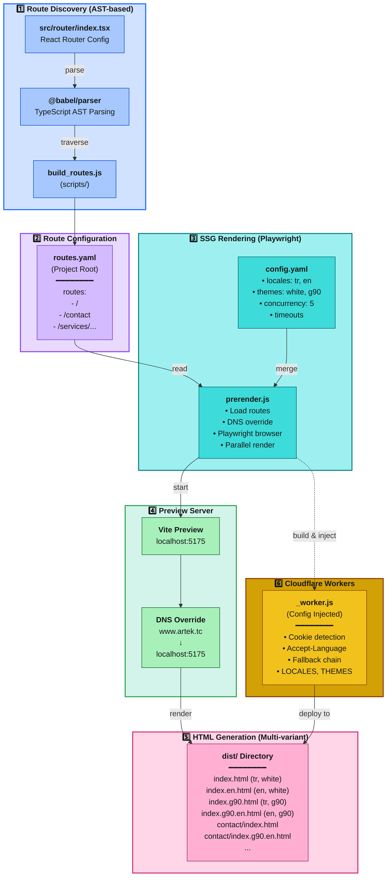
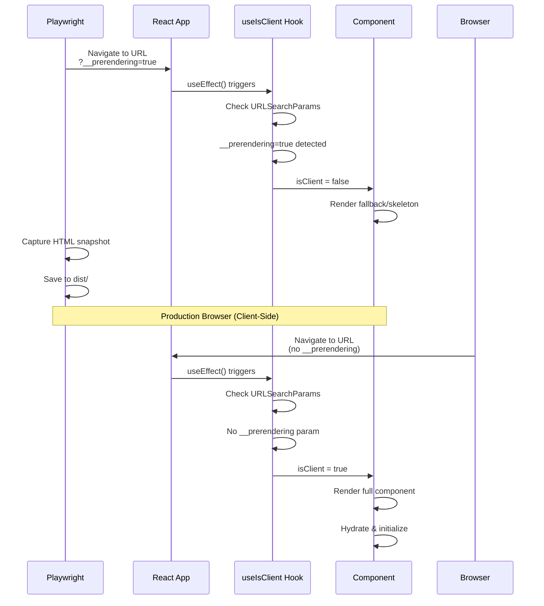

# SSG Pre-Rendering Utility

Playwright tabanlı statik site oluşturma (SSG) aracı. React Router yapılandırmasından otomatik route discovery yaparak, çoklu dil ve tema desteğiyle statik HTML dosyaları üretir.

## Mimari



## Çalışma Prensibi

SSG Pre-Rendering süreci beş aşamadan oluşur:

### 1. Route Discovery

**build_routes.js** (scripts/ dizininde), `src/router/index.tsx` dosyasını Babel ile parse ederek otomatik route keşfi yapar:

- TypeScript kodunu AST'ye dönüştürür
- `createBrowserRouter([...])` çağrısını bulur
- Nested `children` array'lerini recursive traverse eder
- Dynamic route'ları (`:id` gibi) filtreler
- Sonuçları `routes.yaml` dosyasına yazar (project root)

### 2. Configuration Loading

**prerender.js**, iki yapılandırma dosyasını merge eder:
- `config.yaml` (bu dizinde) → locales, themes, timeouts, concurrency
- `routes.yaml` (project root) → render edilecek route listesi

### 3. Parallel Rendering

Her `route × locale × theme` kombinasyonu için:
- Vite preview server başlatılır (localhost:5175)
- Playwright chromium browser açılır
- DNS override ile `production_url` → `localhost:5175` yönlendirmesi
- React app hazır olana kadar beklenir (`#root innerHTML > 100`)
- Network idle durumu kontrol edilir
- HTML içerik kaydedilir

### 4. File Naming Convention

```
Kural: {path}/index{.theme}{.locale}.html

Örnekler:
  / → index.html                    (default theme + default locale)
  / → index.g90.html                (g90 theme, tr locale)
  / → index.en.html                 (white theme, en locale)
  / → index.g90.en.html             (g90 theme, en locale)
  /contact → contact/index.html
  /contact → contact/index.g90.en.html
```

### 5. Cloudflare Workers

**_worker.js** template'i, config değerleriyle inject edilip `dist/_worker.js` olarak kaydedilir. Production'da:
- Cookie'den `preferred_locale` ve `preferred_theme` okur
- Accept-Language header'ını parse eder
- Fallback chain ile doğru HTML dosyasını serve eder

## Desteklenen Yapılandırmalar

| Parametre        | Değer                        | Açıklama                                    |
|------------------|------------------------------|---------------------------------------------|
| **Diller**       | `tr`, `en`                   | Çoklu dil desteği                           |
| **Temalar**      | `white`, `g90`               | Carbon Design System temaları               |
| **Concurrency**  | `5` (varsayılan)             | Paralel render edilen page sayısı           |
| **DNS Override** | `production_url → localhost` | Production URL'i preview server'a yönlendir |
| **Route Source** | `routes.yaml`                | build_routes.js tarafından üretilir         |

## Özellikler

| Özellik                      | Açıklama                                                                          |
|------------------------------|-----------------------------------------------------------------------------------|
| **Otomatik Route Discovery** | React Router yapılandırmasından AST-based route extraction                        |
| **Multi-Locale Rendering**   | Her route için tüm dil varyantları (tr, en)                                       |
| **Multi-Theme Rendering**    | Her route için tüm tema varyantları (white, g90)                                  |
| **Parallel Processing**      | p-limit ile configurable concurrency control                                      |
| **DNS Override Testing**     | Production URL'i localhost'a yönlendirerek gerçekçi test                          |
| **Cookie/Header Detection**  | Cloudflare Workers ile dynamic locale/theme serving                               |
| **Fallback Chain**           | Eksik varyantlar için otomatik fallback (theme+locale → locale → theme → default) |
| **Playwright Integration**   | Gerçek browser rendering (React hydration guaranteed)                             |

## Hızlı Başlangıç

### Ön Gereksinimler

```bash
# 1. Playwright chromium kurulumu
npx playwright install chromium

# 2. Bağımlılıklar
npm install
```

### Adım Adım Kullanım

#### 1. routes.yaml Oluşturma

Router'dan route'ları extract edin:

```bash
npm run routes
```

Bu komut:
- `src/router/index.tsx` dosyasını parse eder
- Tüm route'ları bulur
- `routes.yaml` dosyasını project root'a yazar

**Örnek Çıktı** (routes.yaml):

```yaml
routes:
  - /
  - /company
  - /contact
  - /services/consultancy
```

#### 2. Production Build

Vite build çalıştırarak `dist/` klasörünü oluşturun:

```bash
npm run build
```

#### 3. Pre-Rendering

SSG rendering başlatın:

```bash
npm run prerender
```

Bu komut:
- config.yaml ve routes.yaml yükler
- Vite preview server başlatır (port 5175)
- Her route × locale × theme için HTML üretir
- `_worker.js` dosyasını dist/'e kopyalar (config inject edilmiş)

**Console Output Örneği**:
```
[INFO] SSG Pre-Rendering - Starting
[INFO] Config: 12 routes
[INFO] Cloudflare Worker built (locales: tr, en, themes: white, g90)
[INFO] Starting preview server on port 5175
[INFO] Preview server started (PID: 12345)
[INFO] Pre-rendering 12 routes
[INFO] DNS Override: www.artek.tc → localhost:5175
[INFO] Rendering with concurrency: 5 parallel pages
[INFO] Rendering / [tr] [white]
[INFO] Success: /
...
[INFO] Complete: 48/48 successful (12 routes × 2 locales × 2 themes)
```

#### 4. Full Production Build (Önerilen)

Tüm adımları tek komutla çalıştırın:

```bash
npm run prod
```

Bu komut sırayla:
1. `npm run build` → Vite build
2. `npm run prerender` → SSG rendering
3. `npm run minify:html` → HTML minification

## Dosya Yapısı

```
scripts/utils/prerender-utility/
├── prerender.js         # Ana SSG rendering motoru
├── _worker.js           # Cloudflare Workers template (config injection)
└── config.yaml          # Rendering ayarları (locales, themes, timeouts)

scripts/
└── build_routes.js      # Route extractor (AST-based, upstream dependency)

Project Root/
├── routes.yaml          # Generated routes (build_routes.js tarafından üretilir)
└── dist/                # Build output
    ├── _worker.js       # Cloudflare Workers script (injected config)
    ├── index.html       # / (tr, white)
    ├── index.en.html    # / (en, white)
    ├── index.g90.html   # / (tr, g90)
    ├── index.g90.en.html # / (en, g90)
    └── contact/
        ├── index.html
        └── index.g90.en.html
```

## Yapılandırma Dosyaları

### config.yaml

```yaml
production_url: https://www.artek.tc  # DNS override için
preview_port: 5175                    # Vite preview server portu
default_locale: tr                    # Varsayılan dil
default_theme: white                  # Varsayılan tema
locales:
  - tr
  - en
themes:
  - white
  - g90

# Playwright Ayarları
playwright:
  headless: false                     # Debug için false, production için true
  concurrency: 5                      # Paralel render sayısı (CPU core'a göre)

# Timeout Değerleri (saniye)
page_load_timeout: 30                 # Sayfa yükleme timeout
wait_for_ready_timeout: 15            # React app hazır olma timeout
network_idle_timeout: 10              # Network idle timeout
additional_wait: 2                    # Lazy content için ek bekleme
```

### routes.yaml (Otomatik Üretilir)

```yaml
routes:
  - /
  - /company
  - /contact
  - /under-construction
  - /services/consultancy
  - /services/consultancy/legal-government-sources
  - /services/consultancy/project
  - /services/consultancy/technical-education
  - /services/consultancy/centers/setup
  - /services/consultancy/centers/statistics/design-centers
  - /services/consultancy/centers/statistics/rd-centers
```

**Not**: Bu dosya `build_routes.js` tarafından üretilir. Manuel düzenleme önerilmez.

## Cloudflare Workers Deployment

### _worker.js Config Injection

Build sırasında template değişkenler replace edilir:

```javascript
// Template (_worker.js)
const LOCALES = __LOCALES__;
const DEFAULT_LOCALE = __DEFAULT_LOCALE__;
const THEMES = __THEMES__;
const DEFAULT_THEME = __DEFAULT_THEME__;

// Build sonrası (dist/_worker.js)
const LOCALES = ["tr", "en"];
const DEFAULT_LOCALE = "tr";
const THEMES = ["white", "g90"];
const DEFAULT_THEME = "white";
```

### Worker Logic

#### 1. Locale Detection (Öncelik Sırası)
```text
1. Cookie: preferred_locale=en
2. Accept-Language header (ilk dil): en-US,en;q=0.9 → en
3. Fallback: default_locale (tr)
```

#### 2. Theme Detection
```text
1. Cookie: preferred_theme=g90
2. Fallback: default_theme (white)
```

#### 3. Fallback Chain
```text
// Örnek: /contact?locale=en&theme=g90

Try Order:
1. contact/index.g90.en.html    (full match)
2. contact/index.en.html        (theme fallback)
3. contact/index.g90.html       (locale fallback)
4. contact/index.html           (full fallback)

// İlk 200 status dönen dosya serve edilir
```

### Deployment (Cloudflare Pages)

```bash
# 1. Production build
npm run prod

# 2. Cloudflare Pages deploy
npx wrangler pages deploy dist

# 3. _worker.js otomatik algılanır ve edge'de çalışır
```

## Performance ve Optimizasyon

### Render Performansı

| Metrik                     | Değer            | Açıklama                    |
|----------------------------|------------------|-----------------------------|
| **Örnek Route Sayısı**     | 12 routes        | routes.yaml'dan             |
| **Locale Sayısı**          | 2 (tr, en)       | config.yaml'dan             |
| **Tema Sayısı**            | 2 (white, g90)   | config.yaml'dan             |
| **Total HTML Files**       | 48 (12 × 2 × 2)  | Toplam varyant sayısı       |
| **Concurrency**            | 5 parallel pages | config.yaml'dan             |
| **Ortalama Render Süresi** | ~3-5 saniye/page | Network ve içeriğe bağlı    |
| **Total Build Time**       | ~2-4 dakika      | 48 HTML için (5 concurrent) |

### Optimizasyon Önerileri

#### 1. Concurrency Ayarlama

```yaml
# CPU core sayısına göre ayarlayın
playwright:
  concurrency: 8  # 8 core CPU için
```

#### 2. Timeout Optimizasyonu

```yaml
# Hızlı network için timeout'ları azaltın
page_load_timeout: 15      # 30 → 15
network_idle_timeout: 5    # 10 → 5
additional_wait: 1         # 2 → 1
```

#### 3. Headless Mode (Production)

```yaml
playwright:
  headless: true  # Debug: false, Production: true
```

## npm Scripts İlişkisi

```text
"scripts": {
  "routes": "node scripts/build_routes.js",
  // → routes.yaml oluşturur (route discovery)

  "build": "vite build",
  // → dist/ klasörünü oluşturur

  "preview": "vite preview",
  // → dist/ klasörünü serve eder (SSG için gerekli)

  "prerender": "node scripts/utils/prerender-utility/prerender.js",
  // → SSG rendering (routes.yaml okur, HTML üretir)

  "minify:html": "node scripts/minify_html.js",
  // → HTML dosyalarını minify eder

  "prod": "npm run build && npm run prerender && npm run minify:html",
  // → Full production build

  "prod:kb": "npm run build && npm run prerender && npm run minify:html && npm run render4ai"
  // → Knowledge base için ekstra render
}
```

### Kullanım Senaryoları

```bash
# Senaryo 1: Router değişti, routes.yaml güncelle
npm run routes

# Senaryo 2: Sadece prerender (dist/ mevcut)
npm run prerender

# Senaryo 3: Full production build (önerilen)
npm run prod

# Senaryo 4: AI knowledge base ile
npm run prod:kb
```

## Sorun Giderme

### routes.yaml Bulunamadı
```
[ERROR] File not found: routes.yaml
```
**Çözüm**: Route discovery çalıştırın:
```bash
npm run routes
```

### dist/ Klasörü Yok
```
[ERROR] dist/ not found. Run npm run build first
```
**Çözüm**: Önce Vite build yapın:
```bash
npm run build
```

### Preview Server Başlatılamadı
```
[ERROR] Server exited with code 1
```
**Çözüm**: Port kullanımda olabilir, port değiştirin:
```yaml
# config.yaml
preview_port: 5176  # 5175 → 5176
```

### Boş HTML Çıktısı
```
[ERROR] Empty HTML for /contact
```
**Olası Nedenler**:
- React app yüklenmedi (timeout çok kısa)
- JavaScript hatası (console logları kontrol edin)
- Network idle timeout yetersiz

**Çözüm**: Timeout değerlerini artırın:
```yaml
wait_for_ready_timeout: 30  # 15 → 30
network_idle_timeout: 20    # 10 → 20
```

### Playwright Chromium Yüklü Değil
```
[ERROR] Executable doesn't exist
```
**Çözüm**: Chromium kurulumu:
```bash
npx playwright install chromium
```

### Timeout Hataları
```
[ERROR] Failed /contact: Timeout 30000ms exceeded
```
**Çözüm**: Yavaş network için timeout artırın:
```yaml
page_load_timeout: 60       # 30 → 60
network_idle_timeout: 30    # 10 → 30
```

### DNS Override Çalışmıyor
```
[ERROR] net::ERR_CONNECTION_REFUSED
```
**Çözüm**: Preview server'ın çalıştığından emin olun:
```bash
# Manuel test
npm run preview -- --port 5175
```

## Geliştirme Notları

### Debug Mode

Rendering sürecini debug etmek için:

1. **Headless Mode'u kapatın**:
    ```yaml
    playwright:
      headless: false  # Browser görünür olur
    ``` 
2. **Console logları izleyin**: Browser'da developer tools otomatik açılır.

3. **Tek route test edin**:
    ```yaml
    # routes.yaml (test için)
    routes:
      - /  # Sadece homepage
    ```

### AST-based Route Discovery

`build_routes.js` şu mantıkla çalışır:

```javascript
// src/router/index.tsx
const router = createBrowserRouter([
  {
    path: '/',
    children: [
      { path: 'contact' },        // → /contact
      {
        path: 'services',         // → /services
        children: [
          { path: 'consultancy' } // → /services/consultancy
        ]
      }
    ]
  }
]);

// Extracted routes:
// - /
// - /contact
// - /services
// - /services/consultancy
```

**Not**: Dynamic route'lar (`:id`, `:slug`) otomatik exclude edilir.

### Worker Fallback Logic

```text
// Örnek: Kullanıcı cookie'sini en+g90 olarak ayarlamış
// Route: /contact

Try Order:
1. /contact/index.g90.en.html  ✓ (full match, serve)
2. /contact/index.en.html      (skip)
3. /contact/index.g90.html     (skip)
4. /contact/index.html         (skip)

// Eğer 1 yoksa:
1. /contact/index.g90.en.html  ✗ (not found)
2. /contact/index.en.html      ✓ (locale match, serve)

// Eğer 1 ve 2 yoksa:
1. /contact/index.g90.en.html  ✗
2. /contact/index.en.html      ✗
3. /contact/index.g90.html     ✓ (theme match, serve)

// Hiçbiri yoksa:
4. /contact/index.html         ✓ (default fallback, serve)
```

## React Entegrasyonu ve Client-Side Rendering

Pre-rendering sürecinin React tarafında nasıl handle edildiğini anlamak için `useIsClient` hook'u ve `__prerendering=true` URL parametresi kritik öneme sahiptir.

### URL Parametresi: `__prerendering=true`

#### Playwright Tarafı (prerender.js)

Pre-rendering sırasında her URL'ye bu parametre eklenir:

```javascript
// scripts/utils/prerender-utility/prerender.js (satır 173)
const renderUrl = `${config.production_url}${route}?__prerendering=true&locale=${locale}&theme=${theme}`;

// Örnek URL:
// https://www.artek.tc/contact?__prerendering=true&locale=tr&theme=white
```

Bu parametre sayesinde:
- React app pre-rendering ortamını algılar
- Client-only component'ler (maps, charts, forms) skip edilir
- Hydration mismatch önlenir
- SEO-friendly statik HTML üretilir

#### React Tarafı (useIsClient Hook)

`src/shared/hooks/useIsClient.tsx` hook'u bu parametreyi kontrol eder:

```typescript
import { useState, useEffect } from 'react';

export function useIsClient(): boolean {
  const [isClient, setIsClient] = useState(false);

  useEffect(() => {
    // URL parametresini kontrol et
    const params = new URLSearchParams(window.location.search);
    const isPrerendering = params.get('__prerendering') === 'true';

    // Pre-rendering değilse client-side render
    if (!isPrerendering) {
      setIsClient(true);
    }
  }, []);

  return isClient;
}
```

**Hook Davranışı:**

| Ortam                       | `__prerendering` | `isClient` | Sonuç                                 |
|-----------------------------|------------------|------------|---------------------------------------|
| Playwright (SSG)            | `true`           | `false`    | Client-only component'ler skip edilir |
| Production Browser          | yok              | `true`     | Tüm component'ler render edilir       |
| Development (`npm run dev`) | yok              | `true`     | Tüm component'ler render edilir       |

### Kullanım Örnekleri

#### Örnek 1: Mermaid Diyagram Component'i

**Dosya:** `src/shared/components/visualization/Mermaid.tsx`

```tsx
import { useIsClient } from '@shared/hooks';

const Mermaid: React.FC<MermaidProps> = ({ chart }) => {
  const isClient = useIsClient();

  // Pre-rendering sırasında loading state göster
  if (!isClient) {
    return (
      <div className="mermaid-loading-container">
        <InlineNotification
          kind="info"
          title="Diagram Loading"
          subtitle="Preparing visualization..."
        />
      </div>
    );
  }

  // Client-side'da gerçek component'i render et
  return <MermaidInner chart={chart} />;
};
```

**Neden Gerekli?**
- Mermaid library browser-only API'ler kullanır (`window`, `document`)
- Pre-rendering sırasında bu API'ler kullanılamaz
- SEO için statik fallback gösterilir

#### Örnek 2: Google Maps Component'i

**Dosya:** `src/pages/contact/index.tsx`

```tsx
import { useIsClient, useIsAIRendering } from '@shared/hooks';

const ContactPage: React.FC = () => {
  const isClient = useIsClient();
  const isAIRendering = useIsAIRendering();

  return (
    <div className="map-container">
      {/* GoogleMap sadece client-side'da render edilir */}
      {isClient && !isAIRendering ? (
        <Suspense fallback={<SkeletonPlaceholder />}>
          <GoogleMapComponent
            lat={39.4414677}
            lng={29.9819526}
            zoom={13}
            title="ARTEK"
          />
        </Suspense>
      ) : (
        <div style={{ height: '450px' }}>
          Harita yükleniyor...
        </div>
      )}
    </div>
  );
};
```

**Neden Gerekli?**
- Google Maps API browser-only
- Pre-rendering sırasında API çağrıları yapılamaz
- Placeholder göstererek hydration mismatch önlenir

#### Örnek 3: Contact Form Component'i

**Dosya:** `src/pages/contact/index.tsx`

```tsx
const ContactPage: React.FC = () => {
  const isClient = useIsClient();
  const isAIRendering = useIsAIRendering();

  return (
    <>
      {isClient && !isAIRendering ? (
        <ContactForm locale={locale} translations={t.contactPage} />
      ) : (
        <div className="contact-form">
          <h2>İletişim Formu</h2>
          {/* Skeleton placeholder'lar */}
          <SkeletonPlaceholder style={{ height: '56px' }} />
          <SkeletonPlaceholder style={{ height: '56px' }} />
          <SkeletonPlaceholder style={{ height: '120px' }} />
        </div>
      )}
    </>
  );
};
```

**Neden Gerekli?**
- Form submit event handler'ları browser-only
- Pre-rendering sırasında form state yönetimi gereksiz
- SEO için statik form yapısı yeterli

### Pre-Rendering Akışı (React Perspective)



### Best Practices

#### 1. Her Zaman useIsClient Kullanın

```tsx
// ❌ Yanlış - Browser API'si direkt kullanılıyor
const BadStorageComponent = () => {
  const [userData, setUserData] = useState(localStorage.getItem('user'));
  return <div>{userData}</div>;
};

// ✅ Doğru - useIsClient ile guard
const GoodStorageComponent = () => {
  const isClient = useIsClient();
  const [userData, setUserData] = useState(null);

  useEffect(() => {
    if (isClient) {
      setUserData(localStorage.getItem('user'));
    }
  }, [isClient]);

  return <div>{isClient ? userData : 'Yükleniyor...'}</div>;
};
```

#### 2. Anlamlı Fallback'ler Sağlayın

```tsx
const BadFallbackComponent = () => {
  const isClientMode = useIsClient();

  // ❌ Yanlış - Boş div
  if (!isClientMode) return <div />;

  return <InteractiveChart />;
};

const GoodFallbackComponent = () => {
  const isClientMode = useIsClient();

  // ✅ Doğru - SEO-friendly placeholder
  if (!isClientMode) {
    return (
      <div className="chart-placeholder" aria-label="Grafik yükleniyor">
        <SkeletonPlaceholder />
        <span className="sr-only">Etkileşimli grafik yüklenecek</span>
      </div>
    );
  }

  return <InteractiveChart />;
};
```

#### 3. Lazy Loading ile Kombinasyon

```tsx
import { lazy, Suspense } from 'react';

// Heavy component'i lazy load et
const LazyHeavyChart = lazy(() => import('./HeavyChart'));

const OptimizedChartWrapper = () => {
  const isClientSide = useIsClient();

  if (!isClientSide) {
    return <ChartLoader />;
  }

  return (
    <Suspense fallback={<ChartLoader />}>
      <LazyHeavyChart />
    </Suspense>
  );
};
```

### Debugging Pre-Rendering Issues

#### URL Parametresini Manuel Test Etme

```bash
# Development server'da pre-rendering simülasyonu
http://localhost:5173/contact?__prerendering=true&locale=tr&theme=white
```

Bu URL'i tarayıcıda açtığınızda:
- Client-only component'ler görünmemeli
- Skeleton/placeholder'lar görünmeli
- Console'da hata olmamalı

#### React DevTools ile Debug

1. React DevTools açın
2. `useIsClient` hook state'ini inceleyin
3. Component tree'de conditional render'ları kontrol edin

#### Common Pitfalls

```tsx
// ❌ Yanlış - useEffect içinde window kullanımı
const BadWindowComponent = () => {
  useEffect(() => {
    const width = window.innerWidth; // Pre-rendering'de hata!
    console.log('Width:', width);
  }, []);

  return <div>Component</div>;
};

// ✅ Doğru - isClient guard ile
const GoodWindowComponent = () => {
  const isClientReady = useIsClient();

  useEffect(() => {
    if (isClientReady) {
      const width = window.innerWidth;
      console.log('Width:', width);
    }
  }, [isClientReady]);

  return <div>Component</div>;
};
```


