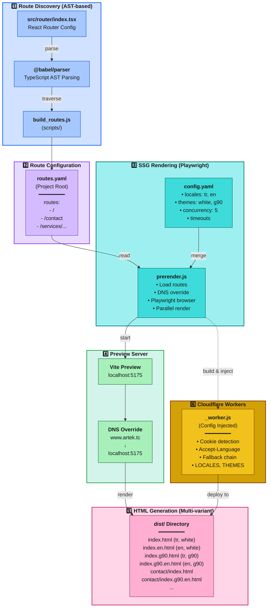
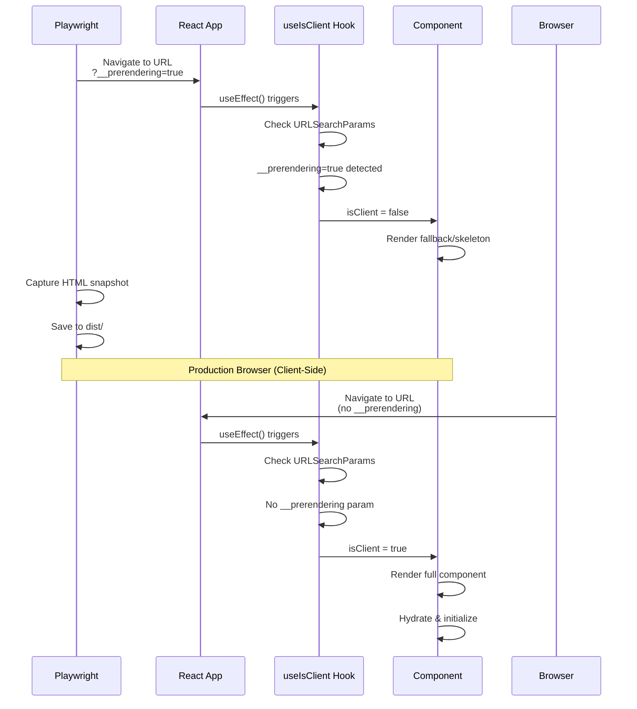

# SSG Pre-Rendering Utility

Playwright-based static site generation (SSG) tool. Automatically discovers routes from React Router configuration and generates static HTML files with multi-locale and multi-theme support.

## Architecture



## How It Works

SSG Pre-Rendering process consists of five stages:

### 1. Route Discovery

**build_routes.js** (in scripts/ directory) performs automatic route discovery by parsing `src/router/index.tsx` with Babel:

- Converts TypeScript code to AST
- Finds `createBrowserRouter([...])` call
- Recursively traverses nested `children` arrays
- Filters dynamic routes (like `:id`)
- Writes results to `routes.yaml` file (project root)

### 2. Configuration Loading

**prerender.js** merges two configuration files:
- `config.yaml` (in this directory) → locales, themes, timeouts, concurrency
- `routes.yaml` (project root) → list of routes to render

### 3. Parallel Rendering

For each `route × locale × theme` combination:
- Vite preview server is started (localhost:5175)
- Playwright chromium browser is opened
- DNS override redirects `production_url` → `localhost:5175`
- Waits until React app is ready (`#root innerHTML > 100`)
- Checks network idle state
- Saves HTML content

### 4. File Naming Convention

```
Rule: {path}/index{.theme}{.locale}.html

Examples:
  / → index.html                    (default theme + default locale)
  / → index.g90.html                (g90 theme, tr locale)
  / → index.en.html                 (white theme, en locale)
  / → index.g90.en.html             (g90 theme, en locale)
  /contact → contact/index.html
  /contact → contact/index.g90.en.html
```

### 5. Cloudflare Workers

**_worker.js** template is injected with config values and saved as `dist/_worker.js`. In production:
- Reads `preferred_locale` and `preferred_theme` from cookies
- Parses Accept-Language header
- Serves correct HTML file using fallback chain

## Supported Configurations

| Parameter        | Value                        | Description                                  |
|------------------|------------------------------|----------------------------------------------|
| **Languages**    | `tr`, `en`                   | Multi-locale support                         |
| **Themes**       | `white`, `g90`               | Carbon Design System themes                  |
| **Concurrency**  | `5` (default)                | Number of parallel page renders              |
| **DNS Override** | `production_url → localhost` | Redirect production URL to preview server    |
| **Route Source** | `routes.yaml`                | Generated by build_routes.js                 |

## Features

| Feature                        | Description                                                                       |
|--------------------------------|-----------------------------------------------------------------------------------|
| **Automatic Route Discovery**  | AST-based route extraction from React Router configuration                        |
| **Multi-Locale Rendering**     | All language variants for each route (tr, en)                                     |
| **Multi-Theme Rendering**      | All theme variants for each route (white, g90)                                    |
| **Parallel Processing**        | Configurable concurrency control with p-limit                                     |
| **DNS Override Testing**       | Realistic testing by redirecting production URL to localhost                      |
| **Cookie/Header Detection**    | Dynamic locale/theme serving with Cloudflare Workers                              |
| **Fallback Chain**             | Automatic fallback for missing variants (theme+locale → locale → theme → default) |
| **Playwright Integration**     | Real browser rendering (React hydration guaranteed)                               |
| **Resource Preload Injection** | Network-based CSS/JS chunk detection and automatic preload hint injection         |

## Quick Start

### Prerequisites

```bash
# 1. Install Playwright chromium
npx playwright install chromium

# 2. Install dependencies
npm install
```

### Step-by-Step Usage

#### 1. Generate routes.yaml

Extract routes from router:

```bash
npm run routes
```

This command:
- Parses `src/router/index.tsx` file
- Finds all routes
- Writes `routes.yaml` file to project root

**Example Output** (routes.yaml):

```yaml
routes:
  - /
  - /company
  - /contact
  - /services/consultancy
```

#### 2. Production Build

Create `dist/` folder by running Vite build:

```bash
npm run build
```

#### 3. Pre-Rendering

Start SSG rendering:

```bash
npm run prerender
```

This command:
- Loads config.yaml and routes.yaml
- Starts Vite preview server (port 5175)
- Generates HTML for each route × locale × theme
- Copies `_worker.js` to dist/ (with injected config)

**Example Console Output**:
```
[INFO] SSG Pre-Rendering - Starting
[INFO] Config: 12 routes
[INFO] Cloudflare Worker built (locales: tr, en, themes: white, g90)
[INFO] Starting preview server on port 5175
[INFO] Preview server started (PID: 12345)
[INFO] Pre-rendering 12 routes
[INFO] DNS Override: www.artek.tc → localhost:5175
[INFO] Rendering with concurrency: 5 parallel pages
[INFO] Rendering / [tr] [white]
[INFO] Success: /
...
[INFO] Complete: 48/48 successful (12 routes × 2 locales × 2 themes)
```

#### 4. Full Production Build (Recommended)

Run all steps with a single command:

```bash
npm run prod
```

This command executes in order:
1. `npm run build` → Vite build
2. `npm run prerender` → SSG rendering


## File Structure

```
scripts/utils/prerender-utility/
├── prerender.js         # Main SSG rendering engine
├── _worker.js           # Cloudflare Workers template (config injection)
└── config.yaml          # Rendering settings (locales, themes, timeouts)

scripts/
└── build_routes.js      # Route extractor (AST-based, upstream dependency)

Project Root/
├── routes.yaml          # Generated routes (created by build_routes.js)
└── dist/                # Build output
    ├── _worker.js       # Cloudflare Workers script (injected config)
    ├── index.html       # / (tr, white)
    ├── index.en.html    # / (en, white)
    ├── index.g90.html   # / (tr, g90)
    ├── index.g90.en.html # / (en, g90)
    └── contact/
        ├── index.html
        └── index.g90.en.html
```

## Configuration Files

### config.yaml

```yaml
production_url: https://www.artek.tc  # For DNS override
preview_port: 5175                    # Vite preview server port
default_locale: tr                    # Default language
default_theme: white                  # Default theme
locales:
  - tr
  - en
themes:
  - white
  - g90

# Playwright Settings
playwright:
  headless: false                     # false for debug, true for production
  concurrency: 5                      # Number of parallel renders (adjust based on CPU cores)

# Timeout Values (seconds)
page_load_timeout: 30                 # Page load timeout
wait_for_ready_timeout: 15            # React app ready timeout
network_idle_timeout: 10              # Network idle timeout
additional_wait: 2                    # Additional wait for lazy content
```

### routes.yaml (Auto-Generated)

```yaml
routes:
  - /
  - /company
  - /contact
  - /under-construction
  - /services/consultancy
  - /services/consultancy/legal-government-sources
  - /services/consultancy/project
  - /services/consultancy/technical-education
  - /services/consultancy/centers/setup
  - /services/consultancy/centers/statistics/design-centers
  - /services/consultancy/centers/statistics/rd-centers
```

**Note**: This file is generated by `build_routes.js`. Manual editing is not recommended.

## Cloudflare Workers Deployment

### _worker.js Config Injection

Template variables are replaced during build:

```javascript
// Template (_worker.js)
const LOCALES = __LOCALES__;
const DEFAULT_LOCALE = __DEFAULT_LOCALE__;
const THEMES = __THEMES__;
const DEFAULT_THEME = __DEFAULT_THEME__;

// After build (dist/_worker.js)
const LOCALES = ["tr", "en"];
const DEFAULT_LOCALE = "tr";
const THEMES = ["white", "g90"];
const DEFAULT_THEME = "white";
```

### Worker Logic

#### 1. Locale Detection (Priority Order)
```text
1. Cookie: preferred_locale=en
2. Accept-Language header (first language): en-US,en;q=0.9 → en
3. Fallback: default_locale (tr)
```

#### 2. Theme Detection
```text
1. Cookie: preferred_theme=g90
2. Fallback: default_theme (white)
```

#### 3. Fallback Chain
```text
// Example: /contact?locale=en&theme=g90

Try Order:
1. contact/index.g90.en.html    (full match)
2. contact/index.en.html        (theme fallback)
3. contact/index.g90.html       (locale fallback)
4. contact/index.html           (full fallback)

// First file with 200 status is served
```

### Deployment (Cloudflare Pages)

```bash
# 1. Production build
npm run prod

# 2. Cloudflare Pages deploy
npx wrangler pages deploy dist

# 3. _worker.js is automatically detected and runs on edge
```

## Performance and Optimization

### Render Performance

| Metric                        | Value            | Description                   |
|-------------------------------|------------------|-------------------------------|
| **Example Route Count**       | 12 routes        | From routes.yaml              |
| **Locale Count**              | 2 (tr, en)       | From config.yaml              |
| **Theme Count**               | 2 (white, g90)   | From config.yaml              |
| **Total HTML Files**          | 48 (12 × 2 × 2)  | Total variant count           |
| **Concurrency**               | 5 parallel pages | From config.yaml              |
| **Average Render Time**       | ~3-5 sec/page    | Depends on network & content  |
| **Total Build Time**          | ~2-4 minutes     | For 48 HTML (5 concurrent)    |

### Optimization Recommendations

#### 1. Concurrency Adjustment

```yaml
# Adjust based on CPU core count
playwright:
  concurrency: 8  # For 8-core CPU
```

#### 2. Timeout Optimization

```yaml
# Reduce timeouts for fast network
page_load_timeout: 15      # 30 → 15
network_idle_timeout: 5    # 10 → 5
additional_wait: 1         # 2 → 1
```

#### 3. Headless Mode (Production)

```yaml
playwright:
  headless: true  # Debug: false, Production: true
```

## npm Scripts Relationship

```text
"scripts": {
  "routes": "node scripts/build_routes.js",
  // → Generates routes.yaml (route discovery)

  "build": "vite build",
  // → Creates dist/ folder

  "preview": "vite preview",
  // → Serves dist/ folder (required for SSG)

  "prerender": "node scripts/utils/prerender-utility/prerender.js",
  // → SSG rendering (reads routes.yaml, generates HTML)

  "minify:html": "node scripts/minify_html.js",
  // → Minifies HTML files

  "prod": "npm run build && npm run prerender",
  // → Full production build
}
```

### Usage Scenarios

```bash
# Scenario 1: Router changed, update routes.yaml
npm run routes

# Scenario 2: Only prerender (dist/ exists)
npm run prerender

# Scenario 3: Full production build (recommended)
npm run prod
```

## Troubleshooting

### routes.yaml Not Found
```
[ERROR] File not found: routes.yaml
```
**Solution**: Run route discovery:
```bash
npm run routes
```

### dist/ Folder Missing
```
[ERROR] dist/ not found. Run npm run build first
```
**Solution**: Run Vite build first:
```bash
npm run build
```

### Preview Server Failed to Start
```
[ERROR] Server exited with code 1
```
**Solution**: Port might be in use, change port:
```yaml
# config.yaml
preview_port: 5176  # 5175 → 5176
```

### Empty HTML Output
```
[ERROR] Empty HTML for /contact
```
**Possible Causes**:
- React app didn't load (timeout too short)
- JavaScript error (check console logs)
- Network idle timeout insufficient

**Solution**: Increase timeout values:
```yaml
wait_for_ready_timeout: 30  # 15 → 30
network_idle_timeout: 20    # 10 → 20
```

### Playwright Chromium Not Installed
```
[ERROR] Executable doesn't exist
```
**Solution**: Install Chromium:
```bash
npx playwright install chromium
```

### Timeout Errors
```
[ERROR] Failed /contact: Timeout 30000ms exceeded
```
**Solution**: Increase timeout for slow network:
```yaml
page_load_timeout: 60       # 30 → 60
network_idle_timeout: 30    # 10 → 30
```

### DNS Override Not Working
```
[ERROR] net::ERR_CONNECTION_REFUSED
```
**Solution**: Ensure preview server is running:
```bash
# Manual test
npm run preview -- --port 5175
```

## Development Notes

### Debug Mode

To debug the rendering process:

1. **Disable Headless Mode**:
    ```yaml
    playwright:
      headless: false  # Browser becomes visible
    ```
2. **Monitor Console Logs**: Developer tools open automatically in browser.

3. **Test Single Route**:
    ```yaml
    # routes.yaml (for testing)
    routes:
      - /  # Homepage only
    ```

### AST-based Route Discovery

`build_routes.js` works with this logic:

```javascript
// src/router/index.tsx
const router = createBrowserRouter([
  {
    path: '/',
    children: [
      { path: 'contact' },        // → /contact
      {
        path: 'services',         // → /services
        children: [
          { path: 'consultancy' } // → /services/consultancy
        ]
      }
    ]
  }
]);

// Extracted routes:
// - /
// - /contact
// - /services
// - /services/consultancy
```

**Note**: Dynamic routes (`:id`, `:slug`) are automatically excluded.

### Worker Fallback Logic

```text
// Example: User set cookie to en+g90
// Route: /contact

Try Order:
1. /contact/index.g90.en.html  ✓ (full match, serve)
2. /contact/index.en.html      (skip)
3. /contact/index.g90.html     (skip)
4. /contact/index.html         (skip)

// If 1 doesn't exist:
1. /contact/index.g90.en.html  ✗ (not found)
2. /contact/index.en.html      ✓ (locale match, serve)

// If 1 and 2 don't exist:
1. /contact/index.g90.en.html  ✗
2. /contact/index.en.html      ✗
3. /contact/index.g90.html     ✓ (theme match, serve)

// If none exist:
4. /contact/index.html         ✓ (default fallback, serve)
```

## React Integration and Client-Side Rendering

Understanding how the pre-rendering process is handled on the React side requires knowledge of the `useIsClient` hook and
`__prerendering=true` URL parameter.

### URL Parameter: `__prerendering=true`

#### Visual Comparison

**Without `__prerendering=true` parameter:**


**With `__prerendering=true` parameter:**


#### Playwright Side (prerender.js)

This parameter is added to every URL during pre-rendering:

```javascript
// scripts/utils/prerender-utility/prerender.js (line 173)
const renderUrl = `${config.production_url}${route}?__prerendering=true&locale=${locale}&theme=${theme}`;

// Example URL:
// https://www.artek.tc/contact?__prerendering=true&locale=tr&theme=white
```

Thanks to this parameter:
- React app detects pre-rendering environment
- Client-only components (maps, charts, forms) are skipped
- Hydration mismatch is prevented
- SEO-friendly static HTML is generated

#### React Side (useIsClient Hook)

`src/shared/hooks/useIsClient.tsx` hook checks this parameter:

```typescript
import { useState, useEffect } from 'react';

export function useIsClient(): boolean {
  const [isClient, setIsClient] = useState(false);

  useEffect(() => {
    // Check URL parameter
    const params = new URLSearchParams(window.location.search);
    const isPrerendering = params.get('__prerendering') === 'true';

    // If not pre-rendering, enable client-side render
    if (!isPrerendering) {
      setIsClient(true);
    }
  }, []);

  return isClient;
}
```

**Hook Behavior:**

| Environment                 | `__prerendering` | `isClient` | Result                              |
|-----------------------------|------------------|------------|-------------------------------------|
| Playwright (SSG)            | `true`           | `false`    | Client-only components are skipped  |
| Production Browser          | none             | `true`     | All components are rendered         |
| Development (`npm run dev`) | none             | `true`     | All components are rendered         |

### Usage Examples

#### Example 1: Mermaid Diagram Component

**File:** `src/shared/components/visualization/Mermaid.tsx`

```tsx
import { useIsClient } from '@shared/hooks';

const Mermaid: React.FC<MermaidProps> = ({ chart }) => {
  const isClient = useIsClient();

  // Show loading state during pre-rendering
  if (!isClient) {
    return (
      <div className="mermaid-loading-container">
        <InlineNotification
          kind="info"
          title="Diagram Loading"
          subtitle="Preparing visualization..."
        />
      </div>
    );
  }

  // Render actual component on client-side
  return <MermaidInner chart={chart} />;
};
```

**Why Is It Needed?**
- Mermaid library uses browser-only APIs (`window`, `document`)
- These APIs cannot be used during pre-rendering
- Static fallback is shown for SEO

#### Example 2: Google Maps Component

**File:** `src/pages/contact/index.tsx`

```tsx
import { useIsClient, useIsAIRendering } from '@shared/hooks';

const ContactPage: React.FC = () => {
  const isClient = useIsClient();
  const isAIRendering = useIsAIRendering();

  return (
    <div className="map-container">
      {/* GoogleMap only renders on client-side */}
      {isClient && !isAIRendering ? (
        <Suspense fallback={<SkeletonPlaceholder />}>
          <GoogleMapComponent
            lat={39.4414677}
            lng={29.9819526}
            zoom={13}
            title="ARTEK"
          />
        </Suspense>
      ) : (
        <div style={{ height: '450px' }}>
          Loading map...
        </div>
      )}
    </div>
  );
};
```

**Why Is It Needed?**
- Google Maps API is browser-only
- API calls cannot be made during pre-rendering
- Hydration mismatch is prevented by showing placeholder

#### Example 3: Contact Form Component

**File:** `src/pages/contact/index.tsx`

```tsx
const ContactPage: React.FC = () => {
  const isClient = useIsClient();
  const isAIRendering = useIsAIRendering();

  return (
    <>
      {isClient && !isAIRendering ? (
        <ContactForm locale={locale} translations={t.contactPage} />
      ) : (
        <div className="contact-form">
          <h2>Contact Form</h2>
          {/* Skeleton placeholders */}
          <SkeletonPlaceholder style={{ height: '56px' }} />
          <SkeletonPlaceholder style={{ height: '56px' }} />
          <SkeletonPlaceholder style={{ height: '120px' }} />
        </div>
      )}
    </>
  );
};
```

**Why Is It Needed?**
- Form submit event handlers are browser-only
- Form state management is unnecessary during pre-rendering
- Static form structure is sufficient for SEO

### Pre-Rendering Flow (React Perspective)



### Best Practices

#### 1. Always Use useIsClient

```tsx
// ❌ Wrong - Browser API used directly
const BadStorageComponent = () => {
  const [userData, setUserData] = useState(localStorage.getItem('user'));
  return <div>{userData}</div>;
};

// ✅ Correct - Guard with useIsClient
const GoodStorageComponent = () => {
  const isClient = useIsClient();
  const [userData, setUserData] = useState(null);

  useEffect(() => {
    if (isClient) {
      setUserData(localStorage.getItem('user'));
    }
  }, [isClient]);

  return <div>{isClient ? userData : 'Loading...'}</div>;
};
```

#### 2. Provide Meaningful Fallbacks

```tsx
const BadFallbackComponent = () => {
  const isClientMode = useIsClient();

  // ❌ Wrong - Empty div
  if (!isClientMode) return <div />;

  return <InteractiveChart />;
};

const GoodFallbackComponent = () => {
  const isClientMode = useIsClient();

  // ✅ Correct - SEO-friendly placeholder
  if (!isClientMode) {
    return (
      <div className="chart-placeholder" aria-label="Chart loading">
        <SkeletonPlaceholder />
        <span className="sr-only">Interactive chart will load</span>
      </div>
    );
  }

  return <InteractiveChart />;
};
```

#### 3. Combination with Lazy Loading

```tsx
import { lazy, Suspense } from 'react';

// Lazy load heavy component
const LazyHeavyChart = lazy(() => import('./HeavyChart'));

const OptimizedChartWrapper = () => {
  const isClientSide = useIsClient();

  if (!isClientSide) {
    return <ChartLoader />;
  }

  return (
    <Suspense fallback={<ChartLoader />}>
      <LazyHeavyChart />
    </Suspense>
  );
};
```

### Debugging Pre-Rendering Issues

#### Manual Testing of URL Parameter

```bash
# Pre-rendering simulation on development server
http://localhost:5173/contact?__prerendering=true&locale=tr&theme=white
```

When you open this URL in browser:
- Client-only components should not be visible
- Skeleton/placeholders should be visible
- No errors should appear in console

#### Debug with React DevTools

1. Open React DevTools
2. Inspect `useIsClient` hook state
3. Check conditional renders in component tree

#### Common Pitfalls

```tsx
// ❌ Wrong - window usage inside useEffect
const BadWindowComponent = () => {
  useEffect(() => {
    const width = window.innerWidth; // Error during pre-rendering!
    console.log('Width:', width);
  }, []);

  return <div>Component</div>;
};

// ✅ Correct - With isClient guard
const GoodWindowComponent = () => {
  const isClientReady = useIsClient();

  useEffect(() => {
    if (isClientReady) {
      const width = window.innerWidth;
      console.log('Width:', width);
    }
  }, [isClientReady]);

  return <div>Component</div>;
};
```

## Resource Preload Injection (Network-Based)

Automatically detects all CSS and JavaScript chunks loaded by the page during pre-rendering and injects `<link rel="preload">`
and `<link rel="modulepreload">` tags into HTML to optimize page performance.

### How It Works

#### 1. Network Monitoring (Playwright)

All HTTP responses are monitored using Playwright's network event listener during pre-rendering:

```javascript
// scripts/utils/prerender-utility/prerender.js (line 180-203)
const resources = {
  css: new Set(),
  js: new Set(),
};

// Monitor network responses for assets
page.on('response', async (response) => {
  const url = response.url();
  if (!response.ok() || !url.includes('/assets/')) return;

  const relativePath = url.replace(config.production_url, '');

  // Track CSS chunks
  if (url.endsWith('.css')) {
    resources.css.add(relativePath);
  }
  // Track JS chunks (excluding main entry point to avoid duplication)
  else if (url.endsWith('.js') && !relativePath.includes('/assets/index-')) {
    resources.js.add(relativePath);
  }
});
```

**Detection Criteria:**
- Response must be `200 OK`
- URL must include `/assets/` (Vite build output)
- CSS: Files with `.css` extension
- JS: Files with `.js` extension (excluding main entry point)

#### 2. Preload Hint Injection

Preload tags are added to the HTML `<head>` section for detected resources:

```javascript
// scripts/utils/prerender-utility/prerender.js (line 228-244)
const preloadHints = [];

// CSS preload links (with crossorigin for CORS compatibility)
if (resources.css.size > 0) {
  Array.from(resources.css).forEach((href) => {
    preloadHints.push(`  <link rel="preload" href="${href}" as="style" crossorigin>`);
  });
}

// JS modulepreload links (for lazy chunks, with crossorigin)
if (resources.js.size > 0) {
  Array.from(resources.js).forEach((href) => {
    preloadHints.push(`  <link rel="modulepreload" href="${href}" crossorigin>`);
  });
}

// Inject all preload hints before </head>
if (preloadHints.length > 0) {
  html = html.replace('</head>', `\n${preloadHints.join('\n')}\n  </head>`);
  log.info(`  → ${resources.css.size} CSS + ${resources.js.size} JS preload(s) injected`);
}
```

#### 3. HTML Beautification (Optional)

HTML output is formatted with prettier (for debugging):

```javascript
// scripts/utils/prerender-utility/prerender.js (line 251-255)
const beautifiedHtml = await prettier.format(html, {
  parser: 'html',
  printWidth: 120,
  tabWidth: 2,
  useTabs: false,
});
```

### Example HTML Output

#### Before (Without Preload Injection)

```html
<!DOCTYPE html>
<html lang="">
  <head>
    <meta charset="UTF-8" />
    <title>ARTEK</title>
    <script type="module" src="/assets/index-abc123.js"></script>
  </head>
  <body>
    <div id="root">...</div>
  </body>
</html>
```

#### After (With Preload Injection)

```html
<!DOCTYPE html>
<html lang="">
  <head>
    <meta charset="UTF-8" />
    <title>ARTEK</title>
    <link rel="preload" href="/assets/carbon-components-DqHF8pL1.css" as="style" crossorigin>
    <link rel="preload" href="/assets/mermaid-BZ4k9pX2.css" as="style" crossorigin>
    <link rel="modulepreload" href="/assets/vendor-react-C8kL3mP9.js" crossorigin>
    <link rel="modulepreload" href="/assets/lazy-chart-DpQ9mN4k.js" crossorigin>
    <script type="module" src="/assets/index-abc123.js"></script>
  </head>
  <body>
    <div id="root">...</div>
  </body>
</html>
```

### Performance Benefits

| Metric                         | Benefit                                                                       |
|--------------------------------|-------------------------------------------------------------------------------|
| **Faster Resource Discovery**  | Browser discovers resources during HTML parse (before JS execution)           |
| **Reduced Render Blocking**    | CSS preload reduces render blocking time                                      |
| **Improved Code Splitting**    | Lazy-loaded chunks load faster (modulepreload)                                |
| **Better Network Utilization** | Parallel resource fetching utilizes network bandwidth efficiently             |
| **Lighthouse Score**           | Performance score increases by +5-10 points (First Contentful Paint improves) |

### Browser Support

| Browser         | `<link rel="preload">` | `<link rel="modulepreload">` | `crossorigin` Attribute |
|-----------------|------------------------|------------------------------|-------------------------|
| **Chrome/Edge** | ✅ v50+                 | ✅ v66+                       | ✅ v64+                  |
| **Firefox**     | ✅ v56+                 | ✅ v115+                      | ✅ v55+                  |
| **Safari**      | ✅ v11.1+               | ⚠️ v16.4+ (partial)          | ✅ v11.1+                |
| **Opera**       | ✅ v37+                 | ✅ v53+                       | ✅ v51+                  |

**Note**: `crossorigin` attribute is required for CORS compatibility (especially when using CDN).

### Console Output

The number of injected resources is logged during pre-rendering:

```bash
[INFO] Rendering / [tr] [white]
[INFO]   → 3 CSS + 5 JS preload(s) injected (8 total)
[INFO] Success: /

[INFO] Rendering /contact [en] [g90]
[INFO]   → 2 CSS + 4 JS preload(s) injected (6 total)
[INFO] Success: /contact
```

### Debugging and Monitoring

#### 1. Network Tab Inspection (DevTools)

Verify that preload hints are working by opening the **Network** tab in browser:

```
Name                              Status  Type        Initiator
carbon-components-DqHF8pL1.css    200     stylesheet  Preload
vendor-react-C8kL3mP9.js          200     script      Preload
```

**If "Initiator" column shows "Preload"** → Hint worked ✅

#### 2. Lighthouse Audit

```bash
# Chrome DevTools > Lighthouse > Performance audit
```

The **"Preload key requests"** suggestion should be removed.

#### 3. HTML Source Inspection

```bash
# Inspect generated HTML file
cat dist/index.html | grep "preload"
```

**Example Output:**
```html
<link rel="preload" href="/assets/carbon-components-DqHF8pL1.css" as="style" crossorigin>
<link rel="modulepreload" href="/assets/vendor-react-C8kL3mP9.js" crossorigin>
```

### Common Issues

#### Preload Hints Not Added

**Symptom:**
```bash
[INFO] Success: /contact
# "→ X CSS + Y JS preload(s) injected" message is missing
```

**Possible Causes:**
- Network timeout too short (HTML captured before resources loaded)
- Wrong `/assets/` prefix (Vite build output in different directory)

**Solution:**
```yaml
# config.yaml - increase timeouts
network_idle_timeout: 20  # 10 → 20
additional_wait: 3        # 2 → 3
```

#### CORS Errors (Console)

**Symptom:**
```
Access to CSS stylesheet blocked by CORS policy
```

**Solution:** `crossorigin` attribute is added to preload tags (automatic):
```html
<link rel="preload" href="..." crossorigin>
```

#### Duplicate Preload Tags

**Symptom:** Multiple preload tags for the same resource.

**Solution:** Automatically deduplicated using `Set()`:
```javascript
const resources = {
  css: new Set(),  // Duplicate entries automatically filtered
  js: new Set(),
};
```

### Best Practices

#### 1. Exclude Main Entry Point

```javascript
// ❌ Wrong - index.js already loaded with <script> tag
if (url.endsWith('.js')) {
  resources.js.add(relativePath);
}

// ✅ Correct - Exclude main entry point
if (url.endsWith('.js') && !relativePath.includes('/assets/index-')) {
  resources.js.add(relativePath);
}
```

#### 2. Only Track Files Under `/assets/`

```javascript
// ❌ Wrong - All JS/CSS files (including external CDN)
if (url.endsWith('.css')) {
  resources.css.add(url);
}

// ✅ Correct - Only local build output
if (url.endsWith('.css') && url.includes('/assets/')) {
  resources.css.add(relativePath);
}
```

#### 3. Use Relative Paths (Not Absolute URLs)

```javascript
// ❌ Wrong - Absolute URL
resources.css.add('https://www.artek.tc/assets/style.css');

// ✅ Correct - Relative path
const relativePath = url.replace(config.production_url, '');
resources.css.add(relativePath);  // /assets/style.css
```

### Comparison: Manual vs Automatic Injection

#### Manual Method (Previous Approach)

```html
<!-- index.html (Manually added preloads) -->
<head>
  <link rel="preload" href="/assets/carbon-components.css" as="style">
  <link rel="modulepreload" href="/assets/vendor-react.js">
  <!-- ❌ Issues:
       - Must be updated when build hash changes (carbon-DqHF8pL1.css)
       - Lazy chunks may be missing
       - Different chunks per route possible
  -->
</head>
```

#### Automatic Method (Network-Based)

```javascript
// prerender.js - Automatic detection
page.on('response', async (response) => {
  // ✅ Advantages:
  // - Build hashes automatically captured
  // - Route-specific chunks detected
  // - Lazy-loaded resources included
  // - Optimized preloads per page
});
```