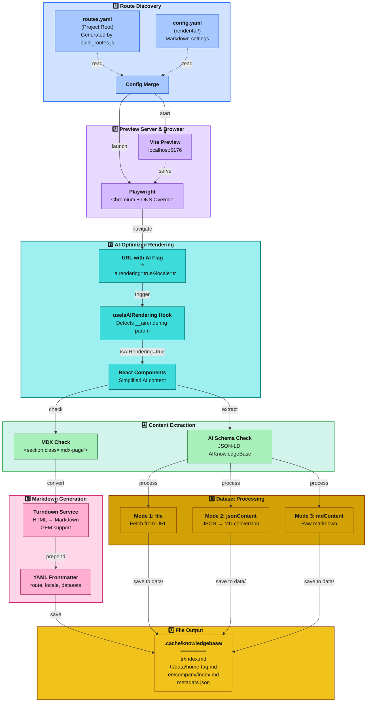
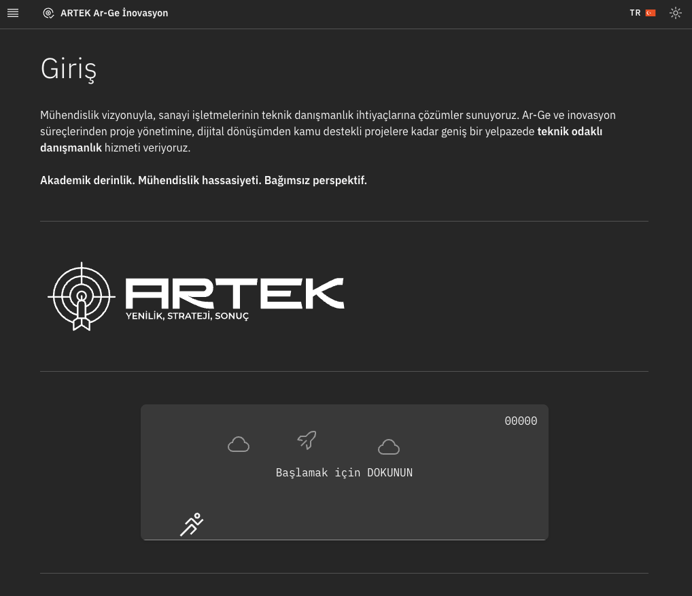
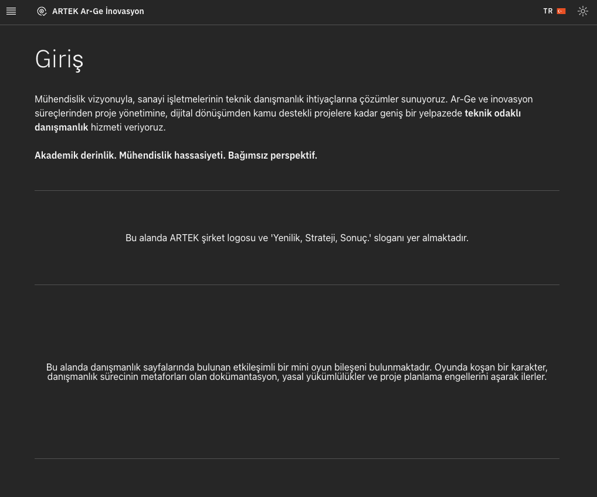
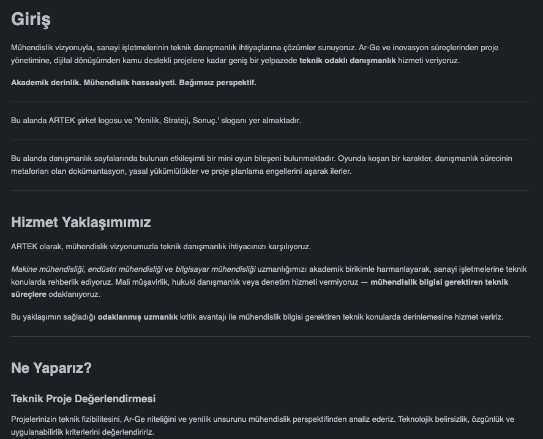
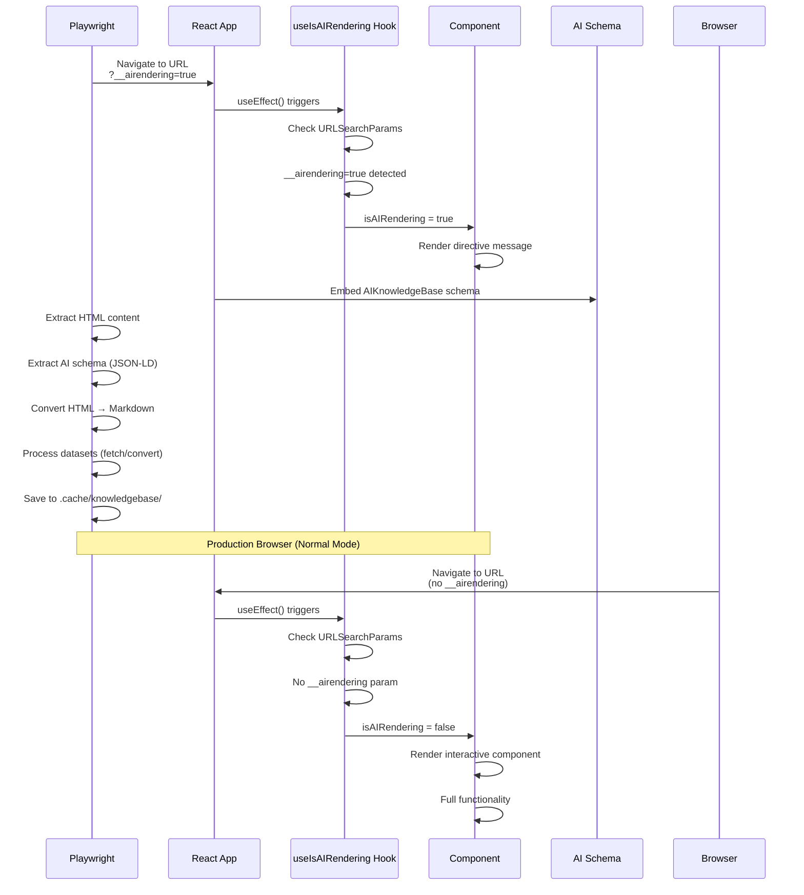

# Render4AI - Markdown Knowledge Base Generator

Playwright tabanlı AI/RAG sistemleri için Markdown knowledge base oluşturma aracı. React web uygulamasını Playwright ile render ederek, HTML içeriği AI-optimized Markdown dosyalarına dönüştürür.

## Mimari



## Çalışma Prensibi

Render4AI süreci yedi aşamadan oluşur:

### 1. Route Discovery

**routes.yaml** dosyası (project root), `build_routes.js` tarafından üretilir. **config.yaml** (bu dizinde) Markdown ayarlarını içerir:

- Heading style (atx: `#`, setext: underline)
- Bullet list marker (`-`, `+`, `*`)
- Code block style (fenced: ` ``` `, indented: 4 spaces)
- Output directory (`.cache/knowledgebase`)

### 2. Preview Server & Browser

- Vite preview server başlatılır (localhost:5176)
- Playwright chromium browser açılır
- DNS override: `production_url` → `localhost:5176`

### 3. AI-Optimized Rendering

<div align="center">
  <table>
    <tr>
      <td align="center"><b>Normal Görünüm</b></td>
      <td align="center"><b>AI-Optimized Görünüm</b></td>
    </tr>
    <tr>
      <td></td>
      <td></td>
    </tr>
    <tr>
      <td align="center"><em>Carbon UI bileşenleri</em></td>
      <td align="center"><em>Sadeleştirilmiş HTML</em></td>
    </tr>
  </table>
</div>

Her route için `__airendering=true` parametresi eklenir:

```javascript
// scripts/utils/render4ai/render.js (satır 775)
const renderUrl = `${config.production_url}${route}?__airendering=true&locale=${locale}`;

// Örnek:
// https://www.artek.tc/contact?__airendering=true&locale=tr
```

Bu parametre sayesinde:
- React component'ler AI rendering modunu algılar
- Interactive component'ler yerine simplified content gösterir
- Charts/maps yerine directive message render edilir
- RAG sistemleri için optimize edilmiş içerik üretilir

### 4. Content Extraction

İki kontrol yapılır:

**a) MDX Check**: `<section class="mdx-page">` var mı?
- ✓ Varsa: MDX içeriği extract edilir
- ✗ Yoksa: AI schema kontrolüne geçilir

**b) AI Schema Check**: JSON-LD `AIKnowledgeBase` schema var mı?
- ✓ Varsa: Dataset'ler işlenir
- ✗ Yoksa: Route skip edilir

### 5. Markdown Generation

**Turndown Service** ile HTML→Markdown dönüşümü:
- GFM (GitHub Flavored Markdown) desteği
- Tablo, strikethrough, task list
- Carbon Design System markup sanitization
- YAML frontmatter ekleme

### 6. Dataset Processing

AIKnowledgeBase schema'dan 3 modda dataset işlenir:

#### Mode 1: file (URL Fetch)
```json
{
  "name": "home-faq",
  "description": "Anasayfa SSS",
  "file": "/data/faq.json"
}
```

#### Mode 2: jsonContent + keyMaps (JSON→MD Conversion)
```json
{
  "name": "contact-info",
  "jsonContent": { "telephone": "+90...", "email": "info@..." },
  "keyMaps": { "telephone": "Telefon", "email": "E-posta" }
}
```

```text
// Output:
// Telefon: +90...
// E-posta: info@...
```

#### Mode 3: mdContent (Raw Markdown)
```json
{
  "name": "about-text",
  "mdContent": "## Hakkımızda\n\nŞirket açıklaması..."
}
```

### 7. File Output

**Dosya Yapısı**:
```
.cache/knowledgebase/
├── metadata.json              # Index file
├── tr/
│   ├── index.md              # Route: / (visual page)
│   ├── data/
│   │   ├── home-hero.md      # Dataset (parent: tr/index.md)
│   │   ├── home-faq.md
│   │   └── home-services.md
│   ├── company/
│   │   └── index.md          # Route: /company (MDX page)
│   └── contact/
│       ├── index.md          # Route: /contact (visual page)
│       └── data/
│           └── contact-info.md
└── en/ (same structure)
```

**Frontmatter Örneği** (route file):
```yaml
---
route: /contact
locale: tr
generated_at: '2025-12-10T21:30:56.576Z'
datasets:
  - name: contact-info
    description: İletişim Bilgileri
    file: tr/contact/data/contact-info.md
    size_bytes: 450
---
```

**Frontmatter Örneği** (dataset file):
```yaml
---
parent_route: /contact
parent_file: tr/contact/index.md
---
```

**Örnek Markdown Çıktısı:**

<div align="center">
  
  <p><em>Render4AI tarafından üretilen temizlenmiş Markdown dosyası örneği</em></p>
</div>

## Desteklenen Yapılandırmalar

| Parametre             | Değer                        | Açıklama                                        |
|-----------------------|------------------------------|-------------------------------------------------|
| **Diller**            | `tr`, `en`                   | Çoklu dil desteği                               |
| **Output Directory**  | `.cache/knowledgebase`       | Markdown dosyaları kayıt dizini                 |
| **Markdown Style**    | ATX, GFM                     | Heading style, bullet marker, fence             |
| **Concurrency**       | `5` (varsayılan)             | Paralel render edilen page sayısı               |
| **HTML Converter**    | Turndown + GFM               | HTML→Markdown dönüştürücü                       |
| **Schema Format**     | AIKnowledgeBase (JSON-LD)    | Dataset metadata standardı                      |

## Özellikler

| Özellik                    | Açıklama                                                         |
|----------------------------|------------------------------------------------------------------|
| **AI-Optimized Content**   | useIsAIRendering hook ile simplified content rendering           |
| **MDX Content Extraction** | `<section class="mdx-page">` içeriğini Markdown'a dönüştürür     |
| **AIKnowledgeBase Schema** | JSON-LD schema ile dataset metadata extraction                   |
| **3 Dataset Modes**        | file (fetch), jsonContent (convert), mdContent (raw)             |
| **YAML Frontmatter**       | Her dosyaya metadata (route, locale, datasets, parent reference) |
| **Co-located Datasets**    | Dataset'ler route ile aynı dizinde (`{route}/data/`)             |
| **Metadata Index**         | metadata.json ile tüm dosyaların index'i                         |
| **Turndown Converter**     | HTML→Markdown with GFM support                                   |
| **Carbon Sanitization**    | Carbon Design System markup temizleme                            |
| **Parallel Processing**    | p-limit ile configurable concurrency                             |

## Hızlı Başlangıç

### Ön Gereksinimler

```bash
# 1. Playwright chromium kurulumu
npx playwright install chromium

# 2. Bağımlılıklar (turndown gerekli)
npm install
```

### Adım Adım Kullanım

#### 1. routes.yaml Oluşturma

```bash
npm run routes
```

Bu komut `src/router/index.tsx` dosyasını parse ederek `routes.yaml` üretir.

#### 2. Production Build

```bash
npm run build
```

Vite build çalıştırarak `dist/` klasörünü oluşturur.

#### 3. Markdown Generation

```bash
npm run render4ai
```

Bu komut:
- config.yaml ve routes.yaml yükler
- Vite preview server başlatır (port 5176)
- Her route × locale için Markdown üretir
- AIKnowledgeBase schema'dan dataset'leri extract eder
- `.cache/knowledgebase/` klasörüne kaydeder

**Console Output Örneği**:
```
[RENDER4AI] Markdown Knowledge Base Generator - Starting
[RENDER4AI] Configuration loaded: 11 routes, 2 locales
[RENDER4AI] Created output directory: scripts/utils/render4ai/.cache/knowledgebase
[RENDER4AI] Starting preview server on port 5176
[RENDER4AI] Preview server started (PID: 12345)
[RENDER4AI] Starting Markdown generation for 11 routes × 2 locales
[RENDER4AI] DNS Override: www.artek.tc → localhost:5176
[RENDER4AI] Rendering with concurrency: 5 parallel pages
[RENDER4AI] Checking: / [tr]
[RENDER4AI]   Found 3 datasets for / [tr]
[RENDER4AI]   • Converting: home-hero (JSON → MD)
[RENDER4AI]   ✓ home-hero (JSON→MD) saved as tr/data/home-hero.md (350 bytes)
[RENDER4AI]   • Converting: home-faq (JSON → MD)
[RENDER4AI]   ✓ home-faq (JSON→MD) saved as tr/data/home-faq.md (1958 bytes)
[RENDER4AI] Rendering (visual): / [tr]
[RENDER4AI] ✓ / [tr] (visual) → .cache/knowledgebase/tr/index.md
[RENDER4AI] Metadata index created: .cache/knowledgebase/metadata.json
[RENDER4AI] ━━━━━━━━━━━━━━━━━━━━━━━━━━━━━━━━━━━━━━━━━━━━━━━━━━━━━━━━━━
[RENDER4AI] Complete: 20/22 Markdown files generated
[RENDER4AI] Skipped: 2 routes (no MDX content)
[RENDER4AI] Output directory: scripts/utils/render4ai/.cache/knowledgebase
[RENDER4AI] ━━━━━━━━━━━━━━━━━━━━━━━━━━━━━━━━━━━━━━━━━━━━━━━━━━━━━━━━━━
```

#### 4. Full Pipeline (Önerilen)

```bash
npm run prod:kb
```

Bu komut sırayla:
1. `npm run build` → Vite build
2. `npm run prerender` → SSG HTML generation
3. `npm run minify:html` → HTML minification
4. `npm run render4ai` → Markdown knowledge base generation

## Dosya Yapısı

```
scripts/utils/render4ai/
├── render.js            # Ana Markdown generator motoru
└── config.yaml          # Markdown ayarları ve timeout değerleri

scripts/
└── build_routes.js      # Route extractor (upstream dependency)

Project Root/
├── routes.yaml          # Generated routes (build_routes.js tarafından üretilir)
└── scripts/utils/render4ai/.cache/knowledgebase/
    ├── metadata.json    # Index file (route→file mapping)
    ├── tr/
    │   ├── index.md              # Route: /
    │   ├── data/
    │   │   ├── home-hero.md      # Dataset
    │   │   ├── home-faq.md       # Dataset
    │   │   └── home-services.md  # Dataset
    │   ├── company/
    │   │   └── index.md          # Route: /company
    │   └── contact/
    │       ├── index.md          # Route: /contact
    │       └── data/
    │           └── contact-info.md # Dataset
    └── en/
        └── (same structure)
```

## Yapılandırma Dosyaları

### config.yaml

```yaml
production_url: https://www.artek.tc  # Production URL
preview_port: 5176                    # Vite preview port (farklı port: 5175 prerender için)

default_locale: tr
locales:
  - tr
  - en

# Markdown Generation Settings
markdown:
  headingStyle: atx              # 'atx' (#) or 'setext' (underline)
  hr: '---'                      # Horizontal rule
  bulletListMarker: '-'          # Bullet list marker
  codeBlockStyle: fenced         # 'fenced' (```) or 'indented'
  fence: '```'                   # Fence characters
  emDelimiter: '_'               # Em delimiter
  strongDelimiter: '**'          # Strong delimiter
  linkStyle: inlined             # 'inlined' or 'referenced'
  linkReferenceStyle: full       # 'full', 'collapsed', 'shortcut'

# Output Settings
output:
  baseDir: scripts/utils/render4ai/.cache/knowledgebase
  generateMetadata: true         # metadata.json oluştur

# Playwright Settings
playwright:
  headless: true                 # Debug: false, Production: true
  concurrency: 5                 # Paralel render sayısı

# Timeouts (seconds)
page_load_timeout: 30
wait_for_ready_timeout: 15
network_idle_timeout: 10
additional_wait: 2

# Server & Resource Timeouts (milliseconds)
server_start_timeout: 3000
server_stop_timeout: 3000
dataset_fetch_timeout: 15000

# Page Ready Check
root_ready_min_length: 100       # #root innerHTML minimum length
```

### routes.yaml (Otomatik Üretilir)

```yaml
routes:
  - /
  - /company
  - /contact
  - /services/consultancy
  - /services/consultancy/project
  # ... diğer route'lar
```

**Not**: Bu dosya `build_routes.js` tarafından üretilir. render4ai bu dosyayı okur.

## AIKnowledgeBase Schema

React component'lerde JSON-LD script tag ile tanımlanır:

### Schema Formatı

```typescript
const aiDataSchema = {
  '@context': 'https://artek.tc/ai-schema',
  '@type': 'AIKnowledgeBase',
  datasets: [
    // Mode 1: file (URL fetch)
    {
      name: 'home-faq',
      description: 'Anasayfa SSS',
      file: '/data/faq.json'
    },
    // Mode 2: jsonContent + keyMaps (conversion)
    {
      name: 'contact-info',
      description: 'İletişim Bilgileri',
      jsonContent: {
        telephone: '+90 (312) 123 45 67',
        email: 'info@artek.tc'
      },
      keyMaps: {
        telephone: 'Telefon',
        email: 'E-posta'
      }
    },
    // Mode 3: mdContent (raw markdown)
    {
      name: 'about-text',
      description: 'Hakkımızda Metni',
      mdContent: '## Hakkımızda\n\nŞirket açıklaması...'
    }
  ]
};
```

### Schema Ekleme (React Component)

```tsx
import SEO from '@shared/components/content/SEO';

const MyPage = () => {
  const schemas = useMemo(() => {
    const aiDataSchema = {
      '@context': 'https://artek.tc/ai-schema',
      '@type': 'AIKnowledgeBase',
      datasets: [
        {
          name: 'example-data',
          description: 'Örnek veri',
          file: '/data/example.json'
        }
      ]
    };

    return [aiDataSchema];
  }, []);

  return (
    <>
      <SEO schemas={schemas} />
      {/* Page content */}
    </>
  );
};
```

## React Entegrasyonu ve AI-Optimized Rendering

Render4AI sürecinin React tarafında nasıl handle edildiğini anlamak için `useIsAIRendering` hook'u ve `__airendering=true` URL parametresi kritik öneme sahiptir.

### URL Parametresi: `__airendering=true`

#### Playwright Tarafı (render.js)

AI rendering sırasında her URL'ye bu parametre eklenir:

```javascript
// scripts/utils/render4ai/render.js (satır 775)
const renderUrl = `${config.production_url}${route}?__airendering=true&locale=${locale}`;

// Örnek URL:
// https://www.artek.tc/contact?__airendering=true&locale=tr
```

Bu parametre sayesinde:
- React app AI rendering modunu algılar
- Interactive component'ler yerine simplified content gösterir
- Charts, maps, forms yerine directive message render edilir
- RAG sistemleri için anlaşılır metadata üretilir

#### React Tarafı (useIsAIRendering Hook)

`src/shared/hooks/useIsAIRendering.tsx` hook'u bu parametreyi kontrol eder:

```typescript
import { useState, useEffect } from 'react';

export function useIsAIRendering(): boolean {
  const [isAIRendering, setIsAIRendering] = useState(false);

  useEffect(() => {
    // URL parametresini kontrol et
    const params = new URLSearchParams(window.location.search);
    const aiRendering = params.get('__airendering') === 'true';

    // AI rendering modunda ise state'i true yap
    if (aiRendering) {
      setIsAIRendering(true);
    }
  }, []);

  return isAIRendering;
}
```

**Hook Davranışı:**

| Ortam                       | `__airendering` | `isAIRendering` | Sonuç                            |
|-----------------------------|-----------------|-----------------|----------------------------------|
| Playwright (render4ai)      | `true`          | `true`          | Simplified AI content render     |
| Production Browser          | yok             | `false`         | Interactive component'ler render |
| Development (`npm run dev`) | yok             | `false`         | Interactive component'ler render |

### Kullanım Örnekleri

#### Örnek 1: SimpleFaq Component'i

**Dosya:** `src/shared/components/ui/SimpleFaq.tsx`

```tsx
  if (isAIRendering) {
   return (
           <Grid>
              <Column xlg={16} lg={16} md={8} sm={4}>
                 <div
                         style={{
                            minHeight: '300px',
                            display: 'flex',
                            alignItems: 'center',
                            justifyContent: 'center',
                            textAlign: 'center',
                         }}
                         aria-hidden="true"
                 >
                    {locale === 'tr'
                            ? `Bu alan üzerinde ${content.length} adet soru-cevap içeren SSS (Sıkça Sorulan Sorular) bileşeni bulunmaktadır. Bu bileşenin içerdiği verinin tam yolu frontmatter'da bulunan metadata üzerinde datasets: anahtarının değerleridir. Bu alandaki içeriği anlamak için datasets: alanındaki verilerin yollarını takip etmen gerekir.`
                            : `This area contains a FAQ (Frequently Asked Questions) component with ${content.length} questions and answers. The full path to the data contained in this component is the values of the datasets: key in the frontmatter metadata. To understand the content in this area, you need to follow the paths of the data in the datasets: field.`}
                 </div>
              </Column>
           </Grid>
   );
}
```

**Neden Gerekli?**
- FAQ component pagination, accordion gibi interactive özellikler içerir
- AI/RAG sistemleri bu interaktif yapıyı anlayamaz
- Directive message, dataset'lerin nerede olduğunu söyler
- RAG sistemi frontmatter'daki `datasets:` alanını takip eder

#### Örnek 2: ChoroplethChart Component'i

**Dosya:** `src/shared/components/visualization/ChoroplethChart.tsx`

```tsx
  if (isAIRendering) {
   return (
           <div
                   style={{
                      height,
                      display: 'flex',
                      alignItems: 'center',
                      justifyContent: 'center',
                      textAlign: 'center',
                   }}
                   aria-hidden="true"
           >
              {locale === 'tr'
                      ? 'Bu alan üzerinde Choropleth harita bileşeni bulunmaktadır. Bu bileşenin içerdiği verinin tam yolu frontmatter\'da bulunan metadata üzerinde datasets: anahtarının değerleridir. Bu alandaki içeriği anlamak için datasets: alanındaki verilerin yollarını takip etmen gerekir.'
                      : 'This area contains a Choropleth map component. The full path to the data contained in this component is the values of the datasets: key in the frontmatter metadata. To understand the content in this area, you need to follow the paths of the data in the datasets: field.'}
           </div>
   );
}
```

**Neden Gerekli?**
- Choropleth chart SVG-based interactive visualization
- Markdown'a dönüştürülebilir değil
- Dataset'ler ayrı JSON/MD dosyalarında saklanır
- AI directive ile dataset lokasyonu belirtilir

#### Örnek 3: Mermaid Diagram Component'i

**Dosya:** `src/shared/components/visualization/Mermaid.tsx` (satır 598-620 arası)

```tsx
  if (isAIRendering) {
   return (
           <div
                   style={{
                      height: '500px',
                      display: 'flex',
                      alignItems: 'center',
                      justifyContent: 'center',
                      textAlign: 'center',
                   }}
                   aria-hidden="true"
           >
              {locale === 'tr'
                      ? 'Bu alan üzerinde Mermaid diyagram bileşeni bulunmaktadır. Bu bileşenin içerdiği verinin tam yolu frontmatter\'da bulunan metadata üzerinde datasets: anahtarının değerleridir. Bu alandaki içeriği anlamak için datasets: alanındaki verilerin yollarını takip etmen gerekir.'
                      : 'This area contains a Mermaid diagram component. The full path to the data contained in this component is the values of the datasets: key in the frontmatter metadata. To understand the content in this area, you need to follow the paths of the data in the datasets: field.'}
           </div>
   );
}
```

**Neden Gerekli?**
- Mermaid diyagramları SVG olarak render edilir
- SVG'yi Markdown'a dönüştürmek anlamsız
- Diyagram source'u (Mermaid syntax) dataset olarak kaydedilir
- AI directive ile dataset'in yolunu gösterir

### Render4AI Akışı (React Perspective)



### Page Kategorileri

| Kategori         | MDX Content | AI Schema | Output                               |
|------------------|-------------|-----------|--------------------------------------|
| **MDX Page**     | ✓ Var       | ✓/✗       | Full MD content + datasets           |
| **Visual Page**  | ✗ Yok       | ✓ Var     | Directive message + datasets         |
| **Skipped Page** | ✗ Yok       | ✗ Yok     | Skip (no MD generated)               |

### Best Practices

#### 1. Her Interactive Component için useIsAIRendering Kullanın

```tsx
// ❌ Yanlış - Interactive component direkt render
const BadChartComponent = ({ data }) => {
  return <ComplexChart data={data} />;
};

// ✅ Doğru - AI rendering için directive
const GoodChartComponent = ({ data }) => {
  const isAIRendering = useIsAIRendering();
  const { locale } = useLocale();

  if (isAIRendering) {
    return (
      <div style={{ minHeight: '400px', textAlign: 'center' }}>
        {locale === 'tr'
          ? 'Bu alan grafik bileşeni içerir. Veriler frontmatter datasets alanındadır.'
          : 'This area contains a chart component. Data is in frontmatter datasets field.'}
      </div>
    );
  }

  return <ComplexChart data={data} />;
};
```

#### 2. AIKnowledgeBase Schema Ekleyin

```tsx
// ❌ Yanlış - Schema yok, dataset'ler extract edilemez
const BadPage = () => {
  return (
    <>
      <SEO title="My Page" />
      <ComplexComponent data={myData} />
    </>
  );
};

// ✅ Doğru - AI schema ile dataset metadata
const GoodPage = () => {
  const schemas = useMemo(() => {
    const aiDataSchema = {
      '@context': 'https://artek.tc/ai-schema',
      '@type': 'AIKnowledgeBase',
      datasets: [
        {
          name: 'my-data',
          description: 'Veri açıklaması',
          jsonContent: myData,
          keyMaps: { key1: 'Label 1', key2: 'Label 2' }
        }
      ]
    };

    return [aiDataSchema];
  }, []);

  return (
    <>
      <SEO schemas={schemas} />
      <ComplexComponent data={myData} />
    </>
  );
};
```

#### 3. Dataset Mode Seçimi

**Senaryo A:** Dış dosyadan fetch

```json
{
  "name": "external-data",
  "file": "/data/statistics.json"  
}
```

**Senaryo B:** Inline JSON → Markdown conversion

```json
{
  "name": "inline-data",
  "jsonContent": [
    { "question": "Soru 1?", "answer": "Cevap 1" },
    { "question": "Soru 2?", "answer": "Cevap 2" }
  ],
  "keyMaps": { "question": "Soru", "answer": "Cevap" }
}
```
Çıktı
```text
// Output:
// Soru: Soru 1?
// Cevap: Cevap 1
//
// Soru: Soru 2?
// Cevap: Cevap 2
```

**Senaryo C:** Raw Markdown (no conversion)
```json
{
"name": "raw-content",
"mdContent": "## Başlık\n\nİçerik metni..."
}
```

### Debugging

#### URL Parametresini Manuel Test Etme

```bash
# Development server'da AI rendering simülasyonu
http://localhost:5173/contact?__airendering=true&locale=tr
```

Bu URL'i tarayıcıda açtığınızda:
- Interactive component'ler directive message göstermeli
- Charts/maps yerine text görünmeli
- Console'da hata olmamalı

#### React DevTools ile Debug

1. React DevTools açın
2. `useIsAIRendering` hook state'ini inceleyin
3. Component tree'de conditional render'ları kontrol edin

#### Generated Markdown Kontrolü

```bash
# Üretilen Markdown dosyalarını kontrol et
cat scripts/utils/render4ai/.cache/knowledgebase/tr/index.md

# Metadata index'i kontrol et
cat scripts/utils/render4ai/.cache/knowledgebase/metadata.json
```

### Common Pitfalls

```tsx
// ❌ Yanlış - useIsAIRendering kontrolü yok
const BadInteractiveMap = () => {
  return <GoogleMap lat={39.44} lng={29.98} />;
};

// ✅ Doğru - AI rendering için directive
const GoodInteractiveMap = () => {
  const isAIRendering = useIsAIRendering();
  const { locale } = useLocale();

  if (isAIRendering) {
    return (
      <div style={{ minHeight: '400px' }}>
        {locale === 'tr'
          ? 'Bu alanda harita bileşeni bulunur. Konum verileri frontmatter datasets alanındadır.'
          : 'This area contains a map component. Location data is in frontmatter datasets field.'}
      </div>
    );
  }

  return <GoogleMap lat={39.44} lng={29.98} />;
};
```

## Performance ve Optimizasyon

### Render Performansı

| Metrik                     | Değer            | Açıklama                       |
|----------------------------|------------------|--------------------------------|
| **Örnek Route Sayısı**     | 11 routes        | routes.yaml'dan                |
| **Locale Sayısı**          | 2 (tr, en)       | config.yaml'dan                |
| **Total Markdown Files**   | 20-22            | MDX + visual pages             |
| **Concurrency**            | 5 parallel pages | config.yaml'dan                |
| **Ortalama Render Süresi** | ~2-4 saniye/page | MDX conversion + dataset fetch |
| **Total Build Time**       | ~1-2 dakika      | 22 MD için (5 concurrent)      |

### Optimizasyon Önerileri

#### 1. Concurrency Ayarlama

```yaml
playwright:
  concurrency: 8  # 8 core CPU için
```

#### 2. Timeout Optimizasyonu

```yaml
# Hızlı network için
page_load_timeout: 20      # 30 → 20
network_idle_timeout: 5    # 10 → 5
dataset_fetch_timeout: 10000  # 15000 → 10000
```

#### 3. Headless Mode (Production)

```yaml
playwright:
  headless: true  # Debug: false, Production: true
```

## npm Scripts İlişkisi

```text
"scripts": {
  "routes": "node scripts/build_routes.js",
  // → routes.yaml oluşturur

  "build": "vite build",
  // → dist/ klasörünü oluşturur

  "render4ai": "node scripts/utils/render4ai/render.js",
  // → Markdown knowledge base oluşturur

  "prod:kb": "npm run build && npm run prerender && npm run minify:html && npm run render4ai"
  // → Full pipeline (HTML + Markdown)
}
```

### Kullanım Senaryoları

```bash
# Senaryo 1: Sadece Markdown generation
npm run render4ai

# Senaryo 2: Full production build + knowledge base
npm run prod:kb

# Senaryo 3: Router değişti, routes.yaml güncelle
npm run routes && npm run render4ai
```

## Sorun Giderme

### routes.yaml Bulunamadı
```
[RENDER4AI] File not found: routes.yaml
```
**Çözüm**: Route discovery çalıştırın:
```bash
npm run routes
```

### Preview Server Başlatılamadı
```
[RENDER4AI] Server exited with code 1
```
**Çözüm**: Port kullanımda olabilir (5176 prerender-utility ile çakışabilir):
```yaml
# config.yaml
preview_port: 5177  # 5176 → 5177
```

### MDX Content Bulunamadı
```
[RENDER4AI] ⊘ /contact [tr] - No MDX content and no AI schema, skipping
```
**Olası Nedenler**:
- Sayfa MDX içerik içermiyor (`<section class="mdx-page">` yok)
- AIKnowledgeBase schema tanımlı değil
- Her iki durumda da skip edilir

**Çözüm**: En az birini ekleyin:
```tsx
// Çözüm 1: MDX content ekle
<section className="mdx-page">
  <h1>Content</h1>
</section>

// Çözüm 2: AI schema ekle
const schemas = [{
  '@type': 'AIKnowledgeBase',
  datasets: [{ name: 'data', file: '/data.json' }]
}];
```

### Dataset Fetch Hatası
```
[RENDER4AI] ✗ home-faq: Failed to fetch
```
**Çözüm**: Dosya yolunu kontrol edin:
```javascript
// ❌ Yanlış - Absolute URL
file: 'https://example.com/data.json'  // CORS hatası

// ✅ Doğru - Relative path
file: '/data/home-faq.json'  // Preview server'dan fetch
```

### Turndown Conversion Hatası
```
[RENDER4AI] Failed to convert HTML to Markdown
```
**Olası Nedenler**:
- Geçersiz HTML markup
- Carbon Design System nested structure

**Çözüm**: HTML sanitization otomatik yapılır, ama complex markup için:
```tsx
// MDX içeriği basit tutun
<section className="mdx-page">
  <h1>Başlık</h1>
  <p>Paragraf</p>
  {/* Nested Carbon component'leri avoid edin */}
</section>
```

## Geliştirme Notları

### Debug Mode

1. **Headless Mode'u kapatın**:
    ```yaml
    playwright:
      headless: false  # Browser görünür olur
    ```

2. **Tek route test edin**:
    ```yaml
    # routes.yaml (test için)
    routes:
      - /  # Sadece homepage
    ```

3. **Console logları inceleyin**: Browser developer tools otomatik açılır.

### Markdown Style Özelleştirme

```yaml
markdown:
  headingStyle: setext     # atx (#) yerine underline
  bulletListMarker: '*'    # - yerine *
  strongDelimiter: '__'    # ** yerine __
```

### AIKnowledgeBase Schema Detayları

#### Dataset Naming Convention
```
Route: /services/consultancy/project
Dataset name: project-consultancy-faq

Saved as: tr/services/consultancy/project/data/project-consultancy-faq.md
```

#### Parent-Child Linking

Dataset dosyalarında `parent_route` ve `parent_file` otomatik eklenir:

```yaml
---
parent_route: /services/consultancy/project
parent_file: tr/services/consultancy/project/index.md
---
```

Bu sayede:
- RAG sistemi bidirectional navigation yapabilir
- Dataset → Parent page ilişkisi korunur
- Context preservation sağlanır
   
