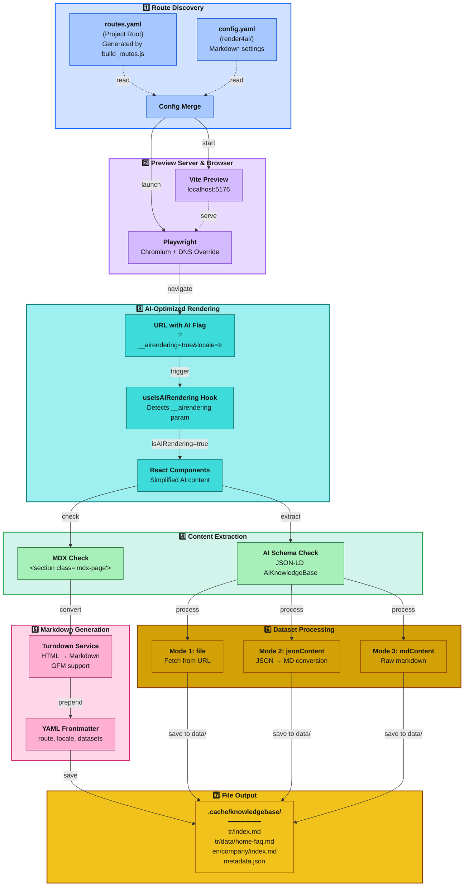
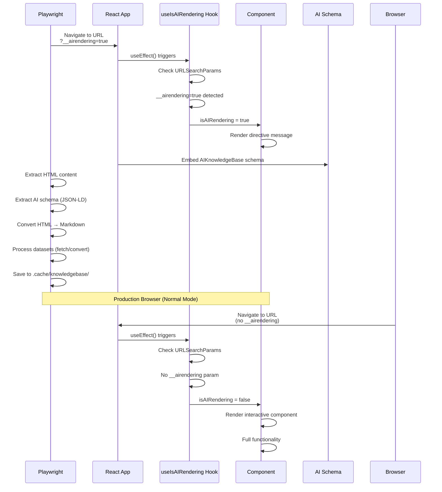

# Render4AI - Markdown Knowledge Base Generator

Playwright-based Markdown knowledge base generation tool for AI/RAG systems. Renders React web application with Playwright and converts HTML content to AI-optimized Markdown files.

## Architecture



## How It Works

Render4AI process consists of seven stages:

### 1. Route Discovery

**routes.yaml** file (project root) is generated by `build_routes.js`. **config.yaml** (in this directory) contains Markdown settings:

- Heading style (atx: `#`, setext: underline)
- Bullet list marker (`-`, `+`, `*`)
- Code block style (fenced: ` ``` `, indented: 4 spaces)
- Output directory (`.cache/knowledgebase`)

### 2. Preview Server & Browser

- Vite preview server is started (localhost:5176)
- Playwright chromium browser is opened
- DNS override: `production_url` → `localhost:5176`

### 3. AI-Optimized Rendering

`__airendering=true` parameter is added for each route:

```javascript
// scripts/utils/render4ai/render.js (line 775)
const renderUrl = `${config.production_url}${route}?__airendering=true&locale=${locale}`;

// Example:
// https://www.artek.tc/contact?__airendering=true&locale=tr
```

Thanks to this parameter:
- React components detect AI rendering mode
- Simplified content is shown instead of interactive components
- Directive messages are rendered instead of charts/maps
- Optimized content is generated for RAG systems

### 4. Content Extraction

Two checks are performed:

**a) MDX Check**: Does `<section class="mdx-page">` exist?
- ✓ Yes: MDX content is extracted
- ✗ No: Proceeds to AI schema check

**b) AI Schema Check**: Does JSON-LD `AIKnowledgeBase` schema exist?
- ✓ Yes: Datasets are processed
- ✗ No: Route is skipped

### 5. Markdown Generation

HTML→Markdown conversion with **Turndown Service**:
- GFM (GitHub Flavored Markdown) support
- Tables, strikethrough, task lists
- Carbon Design System markup sanitization
- YAML frontmatter addition

### 6. Dataset Processing

Datasets are processed in 3 modes from AIKnowledgeBase schema:

#### Mode 1: file (URL Fetch)
```json
{
  "name": "home-faq",
  "description": "Homepage FAQ",
  "file": "/data/faq.json"
}
```

#### Mode 2: jsonContent + keyMaps (JSON→MD Conversion)
```json
{
  "name": "contact-info",
  "jsonContent": { "telephone": "+90...", "email": "info@..." },
  "keyMaps": { "telephone": "Telephone", "email": "Email" }
}
```

```text
// Output:
// Telephone: +90...
// Email: info@...
```

#### Mode 3: mdContent (Raw Markdown)
```json
{
  "name": "about-text",
  "mdContent": "## About Us\n\nCompany description..."
}
```

### 7. File Output

**File Structure**:
```
.cache/knowledgebase/
├── metadata.json              # Index file
├── tr/
│   ├── index.md              # Route: / (visual page)
│   ├── data/
│   │   ├── home-hero.md      # Dataset (parent: tr/index.md)
│   │   ├── home-faq.md
│   │   └── home-services.md
│   ├── company/
│   │   └── index.md          # Route: /company (MDX page)
│   └── contact/
│       ├── index.md          # Route: /contact (visual page)
│       └── data/
│           └── contact-info.md
└── en/ (same structure)
```

**Frontmatter Example** (route file):
```yaml
---
route: /contact
locale: tr
generated_at: '2025-12-10T21:30:56.576Z'
datasets:
  - name: contact-info
    description: Contact Information
    file: tr/contact/data/contact-info.md
    size_bytes: 450
---
```

**Frontmatter Example** (dataset file):
```yaml
---
parent_route: /contact
parent_file: tr/contact/index.md
---
```

## Supported Configurations

| Parameter             | Value                        | Description                                     |
|-----------------------|------------------------------|-------------------------------------------------|
| **Languages**         | `tr`, `en`                   | Multi-locale support                            |
| **Output Directory**  | `.cache/knowledgebase`       | Markdown files save directory                   |
| **Markdown Style**    | ATX, GFM                     | Heading style, bullet marker, fence             |
| **Concurrency**       | `5` (default)                | Number of parallel page renders                 |
| **HTML Converter**    | Turndown + GFM               | HTML→Markdown converter                         |
| **Schema Format**     | AIKnowledgeBase (JSON-LD)    | Dataset metadata standard                       |

## Features

| Feature                    | Description                                                        |
|----------------------------|--------------------------------------------------------------------|
| **AI-Optimized Content**   | Simplified content rendering with useIsAIRendering hook            |
| **MDX Content Extraction** | Converts `<section class="mdx-page">` content to Markdown          |
| **AIKnowledgeBase Schema** | Dataset metadata extraction with JSON-LD schema                    |
| **3 Dataset Modes**        | file (fetch), jsonContent (convert), mdContent (raw)               |
| **YAML Frontmatter**       | Metadata for each file (route, locale, datasets, parent reference) |
| **Co-located Datasets**    | Datasets in same directory with route (`{route}/data/`)            |
| **Metadata Index**         | Index of all files with metadata.json                              |
| **Turndown Converter**     | HTML→Markdown with GFM support                                     |
| **Carbon Sanitization**    | Carbon Design System markup cleanup                                |
| **Parallel Processing**    | Configurable concurrency with p-limit                              |

## Quick Start

### Prerequisites

```bash
# 1. Install Playwright chromium
npx playwright install chromium

# 2. Install dependencies (turndown required)
npm install
```

### Step-by-Step Usage

#### 1. Generate routes.yaml

```bash
npm run routes
```

This command parses `src/router/index.tsx` and generates `routes.yaml`.

#### 2. Production Build

```bash
npm run build
```

Creates `dist/` folder by running Vite build.

#### 3. Markdown Generation

```bash
npm run render4ai
```

This command:
- Loads config.yaml and routes.yaml
- Starts Vite preview server (port 5176)
- Generates Markdown for each route × locale
- Extracts datasets from AIKnowledgeBase schema
- Saves to `.cache/knowledgebase/` folder

**Example Console Output**:
```
[RENDER4AI] Markdown Knowledge Base Generator - Starting
[RENDER4AI] Configuration loaded: 11 routes, 2 locales
[RENDER4AI] Created output directory: scripts/utils/render4ai/.cache/knowledgebase
[RENDER4AI] Starting preview server on port 5176
[RENDER4AI] Preview server started (PID: 12345)
[RENDER4AI] Starting Markdown generation for 11 routes × 2 locales
[RENDER4AI] DNS Override: www.artek.tc → localhost:5176
[RENDER4AI] Rendering with concurrency: 5 parallel pages
[RENDER4AI] Checking: / [tr]
[RENDER4AI]   Found 3 datasets for / [tr]
[RENDER4AI]   • Converting: home-hero (JSON → MD)
[RENDER4AI]   ✓ home-hero (JSON→MD) saved as tr/data/home-hero.md (350 bytes)
[RENDER4AI]   • Converting: home-faq (JSON → MD)
[RENDER4AI]   ✓ home-faq (JSON→MD) saved as tr/data/home-faq.md (1958 bytes)
[RENDER4AI] Rendering (visual): / [tr]
[RENDER4AI] ✓ / [tr] (visual) → .cache/knowledgebase/tr/index.md
[RENDER4AI] Metadata index created: .cache/knowledgebase/metadata.json
[RENDER4AI] ━━━━━━━━━━━━━━━━━━━━━━━━━━━━━━━━━━━━━━━━━━━━━━━━━━━━━━━━━━
[RENDER4AI] Complete: 20/22 Markdown files generated
[RENDER4AI] Skipped: 2 routes (no MDX content)
[RENDER4AI] Output directory: scripts/utils/render4ai/.cache/knowledgebase
[RENDER4AI] ━━━━━━━━━━━━━━━━━━━━━━━━━━━━━━━━━━━━━━━━━━━━━━━━━━━━━━━━━━
```

#### 4. Full Pipeline (Recommended)

```bash
npm run prod:kb
```

This command executes in order:
1. `npm run build` → Vite build
2. `npm run prerender` → SSG HTML generation
3. `npm run minify:html` → HTML minification
4. `npm run render4ai` → Markdown knowledge base generation

## File Structure

```
scripts/utils/render4ai/
├── render.js            # Main Markdown generator engine
└── config.yaml          # Markdown settings and timeout values

scripts/
└── build_routes.js      # Route extractor (upstream dependency)

Project Root/
├── routes.yaml          # Generated routes (created by build_routes.js)
└── scripts/utils/render4ai/.cache/knowledgebase/
    ├── metadata.json    # Index file (route→file mapping)
    ├── tr/
    │   ├── index.md              # Route: /
    │   ├── data/
    │   │   ├── home-hero.md      # Dataset
    │   │   ├── home-faq.md       # Dataset
    │   │   └── home-services.md  # Dataset
    │   ├── company/
    │   │   └── index.md          # Route: /company
    │   └── contact/
    │       ├── index.md          # Route: /contact
    │       └── data/
    │           └── contact-info.md # Dataset
    └── en/
        └── (same structure)
```

## Configuration Files

### config.yaml

```yaml
production_url: https://www.artek.tc  # Production URL
preview_port: 5176                    # Vite preview port (different port: 5175 for prerender)

default_locale: tr
locales:
  - tr
  - en

# Markdown Generation Settings
markdown:
  headingStyle: atx              # 'atx' (#) or 'setext' (underline)
  hr: '---'                      # Horizontal rule
  bulletListMarker: '-'          # Bullet list marker
  codeBlockStyle: fenced         # 'fenced' (```) or 'indented'
  fence: '```'                   # Fence characters
  emDelimiter: '_'               # Em delimiter
  strongDelimiter: '**'          # Strong delimiter
  linkStyle: inlined             # 'inlined' or 'referenced'
  linkReferenceStyle: full       # 'full', 'collapsed', 'shortcut'

# Output Settings
output:
  baseDir: scripts/utils/render4ai/.cache/knowledgebase
  generateMetadata: true         # Generate metadata.json

# Playwright Settings
playwright:
  headless: true                 # Debug: false, Production: true
  concurrency: 5                 # Number of parallel renders

# Timeouts (seconds)
page_load_timeout: 30
wait_for_ready_timeout: 15
network_idle_timeout: 10
additional_wait: 2

# Server & Resource Timeouts (milliseconds)
server_start_timeout: 3000
server_stop_timeout: 3000
dataset_fetch_timeout: 15000

# Page Ready Check
root_ready_min_length: 100       # #root innerHTML minimum length
```

### routes.yaml (Auto-Generated)

```yaml
routes:
  - /
  - /company
  - /contact
  - /services/consultancy
  - /services/consultancy/project
  # ... other routes
```

**Note**: This file is generated by `build_routes.js`. render4ai reads this file.

## AIKnowledgeBase Schema

Defined in React components with JSON-LD script tag:

### Schema Format

```typescript
const aiDataSchema = {
  '@context': 'https://artek.tc/ai-schema',
  '@type': 'AIKnowledgeBase',
  datasets: [
    // Mode 1: file (URL fetch)
    {
      name: 'home-faq',
      description: 'Homepage FAQ',
      file: '/data/faq.json'
    },
    // Mode 2: jsonContent + keyMaps (conversion)
    {
      name: 'contact-info',
      description: 'Contact Information',
      jsonContent: {
        telephone: '+90 (312) 123 45 67',
        email: 'info@artek.tc'
      },
      keyMaps: {
        telephone: 'Telephone',
        email: 'Email'
      }
    },
    // Mode 3: mdContent (raw markdown)
    {
      name: 'about-text',
      description: 'About Text',
      mdContent: '## About Us\n\nCompany description...'
    }
  ]
};
```

### Adding Schema (React Component)

```tsx
import SEO from '@shared/components/content/SEO';

const MyPage = () => {
  const schemas = useMemo(() => {
    const aiDataSchema = {
      '@context': 'https://artek.tc/ai-schema',
      '@type': 'AIKnowledgeBase',
      datasets: [
        {
          name: 'example-data',
          description: 'Example data',
          file: '/data/example.json'
        }
      ]
    };

    return [aiDataSchema];
  }, []);

  return (
    <>
      <SEO schemas={schemas} />
      {/* Page content */}
    </>
  );
};
```

## React Integration and AI-Optimized Rendering

Understanding how the Render4AI process is handled on the React side requires knowledge of the `useIsAIRendering` hook and `__airendering=true` URL parameter.

### URL Parameter: `__airendering=true`

#### Playwright Side (render.js)

This parameter is added to every URL during AI rendering:

```javascript
// scripts/utils/render4ai/render.js (line 775)
const renderUrl = `${config.production_url}${route}?__airendering=true&locale=${locale}`;

// Example URL:
// https://www.artek.tc/contact?__airendering=true&locale=tr
```

Thanks to this parameter:
- React app detects AI rendering mode
- Simplified content is shown instead of interactive components
- Directive messages are rendered instead of charts, maps, forms
- Understandable metadata is generated for RAG systems

#### React Side (useIsAIRendering Hook)

`src/shared/hooks/useIsAIRendering.tsx` hook checks this parameter:

```typescript
import { useState, useEffect } from 'react';

export function useIsAIRendering(): boolean {
  const [isAIRendering, setIsAIRendering] = useState(false);

  useEffect(() => {
    // Check URL parameter
    const params = new URLSearchParams(window.location.search);
    const aiRendering = params.get('__airendering') === 'true';

    // If in AI rendering mode, set state to true
    if (aiRendering) {
      setIsAIRendering(true);
    }
  }, []);

  return isAIRendering;
}
```

**Hook Behavior:**

| Environment                 | `__airendering` | `isAIRendering` | Result                        |
|-----------------------------|-----------------|-----------------|-------------------------------|
| Playwright (render4ai)      | `true`          | `true`          | Simplified AI content render  |
| Production Browser          | none            | `false`         | Interactive components render |
| Development (`npm run dev`) | none            | `false`         | Interactive components render |

### Usage Examples

#### Example 1: SimpleFaq Component

**File:** `src/shared/components/ui/SimpleFaq.tsx`

```tsx
  if (isAIRendering) {
   return (
           <Grid>
              <Column xlg={16} lg={16} md={8} sm={4}>
                 <div
                         style={{
                            minHeight: '300px',
                            display: 'flex',
                            alignItems: 'center',
                            justifyContent: 'center',
                            textAlign: 'center',
                         }}
                         aria-hidden="true"
                 >
                    {locale === 'tr'
                            ? `Bu alan üzerinde ${content.length} adet soru-cevap içeren SSS (Sıkça Sorulan Sorular) bileşeni bulunmaktadır. Bu bileşenin içerdiği verinin tam yolu frontmatter'da bulunan metadata üzerinde datasets: anahtarının değerleridir. Bu alandaki içeriği anlamak için datasets: alanındaki verilerin yollarını takip etmen gerekir.`
                            : `This area contains a FAQ (Frequently Asked Questions) component with ${content.length} questions and answers. The full path to the data contained in this component is the values of the datasets: key in the frontmatter metadata. To understand the content in this area, you need to follow the paths of the data in the datasets: field.`}
                 </div>
              </Column>
           </Grid>
   );
}
```

**Why Is It Needed?**
- FAQ component contains interactive features like pagination and accordion
- AI/RAG systems cannot understand this interactive structure
- Directive message tells where datasets are located
- RAG system follows the `datasets:` field in frontmatter

#### Example 2: ChoroplethChart Component

**File:** `src/shared/components/visualization/ChoroplethChart.tsx`

```tsx
  if (isAIRendering) {
   return (
           <div
                   style={{
                      height,
                      display: 'flex',
                      alignItems: 'center',
                      justifyContent: 'center',
                      textAlign: 'center',
                   }}
                   aria-hidden="true"
           >
              {locale === 'tr'
                      ? 'Bu alan üzerinde Choropleth harita bileşeni bulunmaktadır. Bu bileşenin içerdiği verinin tam yolu frontmatter\'da bulunan metadata üzerinde datasets: anahtarının değerleridir. Bu alandaki içeriği anlamak için datasets: alanındaki verilerin yollarını takip etmen gerekir.'
                      : 'This area contains a Choropleth map component. The full path to the data contained in this component is the values of the datasets: key in the frontmatter metadata. To understand the content in this area, you need to follow the paths of the data in the datasets: field.'}
           </div>
   );
}
```

**Why Is It Needed?**
- Choropleth chart is SVG-based interactive visualization
- Cannot be converted to Markdown
- Datasets are stored in separate JSON/MD files
- Dataset location is specified with AI directive

#### Example 3: Mermaid Diagram Component

**File:** `src/shared/components/visualization/Mermaid.tsx` (lines 598-620)

```tsx
  if (isAIRendering) {
   return (
           <div
                   style={{
                      height: '500px',
                      display: 'flex',
                      alignItems: 'center',
                      justifyContent: 'center',
                      textAlign: 'center',
                   }}
                   aria-hidden="true"
           >
              {locale === 'tr'
                      ? 'Bu alan üzerinde Mermaid diyagram bileşeni bulunmaktadır. Bu bileşenin içerdiği verinin tam yolu frontmatter\'da bulunan metadata üzerinde datasets: anahtarının değerleridir. Bu alandaki içeriği anlamak için datasets: alanındaki verilerin yollarını takip etmen gerekir.'
                      : 'This area contains a Mermaid diagram component. The full path to the data contained in this component is the values of the datasets: key in the frontmatter metadata. To understand the content in this area, you need to follow the paths of the data in the datasets: field.'}
           </div>
   );
}
```

**Why Is It Needed?**
- Mermaid diagrams are rendered as SVG
- Converting SVG to Markdown is meaningless
- Diagram source (Mermaid syntax) is saved as dataset
- AI directive shows dataset path

### Render4AI Flow (React Perspective)



### Page Categories

| Category         | MDX Content | AI Schema | Output                               |
|------------------|-------------|-----------|--------------------------------------|
| **MDX Page**     | ✓ Yes       | ✓/✗       | Full MD content + datasets           |
| **Visual Page**  | ✗ No        | ✓ Yes     | Directive message + datasets         |
| **Skipped Page** | ✗ No        | ✗ No      | Skip (no MD generated)               |

### Best Practices

#### 1. Use useIsAIRendering for Every Interactive Component

```tsx
// ❌ Wrong - Interactive component rendered directly
const BadChartComponent = ({ data }) => {
  return <ComplexChart data={data} />;
};

// ✅ Correct - Directive for AI rendering
const GoodChartComponent = ({ data }) => {
  const isAIRendering = useIsAIRendering();
  const { locale } = useLocale();

  if (isAIRendering) {
    return (
      <div style={{ minHeight: '400px', textAlign: 'center' }}>
        {locale === 'tr'
          ? 'Bu alan grafik bileşeni içerir. Veriler frontmatter datasets alanındadır.'
          : 'This area contains a chart component. Data is in frontmatter datasets field.'}
      </div>
    );
  }

  return <ComplexChart data={data} />;
};
```

#### 2. Add AIKnowledgeBase Schema

```tsx
// ❌ Wrong - No schema, datasets cannot be extracted
const BadPage = () => {
  return (
    <>
      <SEO title="My Page" />
      <ComplexComponent data={myData} />
    </>
  );
};

// ✅ Correct - AI schema with dataset metadata
const GoodPage = () => {
  const schemas = useMemo(() => {
    const aiDataSchema = {
      '@context': 'https://artek.tc/ai-schema',
      '@type': 'AIKnowledgeBase',
      datasets: [
        {
          name: 'my-data',
          description: 'Data description',
          jsonContent: myData,
          keyMaps: { key1: 'Label 1', key2: 'Label 2' }
        }
      ]
    };

    return [aiDataSchema];
  }, []);

  return (
    <>
      <SEO schemas={schemas} />
      <ComplexComponent data={myData} />
    </>
  );
};
```

#### 3. Dataset Mode Selection

**Scenario A:** Fetch from external file

```json
{
  "name": "external-data",
  "file": "/data/statistics.json"
}
```

**Scenario B:** Inline JSON → Markdown conversion

```json
{
  "name": "inline-data",
  "jsonContent": [
    { "question": "Question 1?", "answer": "Answer 1" },
    { "question": "Question 2?", "answer": "Answer 2" }
  ],
  "keyMaps": { "question": "Question", "answer": "Answer" }
}
```
Output
```text
// Output:
// Question: Question 1?
// Answer: Answer 1
//
// Question: Question 2?
// Answer: Answer 2
```

**Scenario C:** Raw Markdown (no conversion)
```json
{
"name": "raw-content",
"mdContent": "## Heading\n\nContent text..."
}
```

### Debugging

#### Manual Testing of URL Parameter

```bash
# AI rendering simulation on development server
http://localhost:5173/contact?__airendering=true&locale=tr
```

When you open this URL in browser:
- Interactive components should show directive messages
- Text should appear instead of charts/maps
- No errors should appear in console

#### Debug with React DevTools

1. Open React DevTools
2. Inspect `useIsAIRendering` hook state
3. Check conditional renders in component tree

#### Check Generated Markdown

```bash
# Check generated Markdown files
cat scripts/utils/render4ai/.cache/knowledgebase/tr/index.md

# Check metadata index
cat scripts/utils/render4ai/.cache/knowledgebase/metadata.json
```

### Common Pitfalls

```tsx
// ❌ Wrong - No useIsAIRendering check
const BadInteractiveMap = () => {
  return <GoogleMap lat={39.44} lng={29.98} />;
};

// ✅ Correct - Directive for AI rendering
const GoodInteractiveMap = () => {
  const isAIRendering = useIsAIRendering();
  const { locale } = useLocale();

  if (isAIRendering) {
    return (
      <div style={{ minHeight: '400px' }}>
        {locale === 'tr'
          ? 'Bu alanda harita bileşeni bulunur. Konum verileri frontmatter datasets alanındadır.'
          : 'This area contains a map component. Location data is in frontmatter datasets field.'}
      </div>
    );
  }

  return <GoogleMap lat={39.44} lng={29.98} />;
};
```

## Performance and Optimization

### Render Performance

| Metric                     | Value            | Description                    |
|----------------------------|------------------|--------------------------------|
| **Example Route Count**    | 11 routes        | From routes.yaml               |
| **Locale Count**           | 2 (tr, en)       | From config.yaml               |
| **Total Markdown Files**   | 20-22            | MDX + visual pages             |
| **Concurrency**            | 5 parallel pages | From config.yaml               |
| **Average Render Time**    | ~2-4 sec/page    | MDX conversion + dataset fetch |
| **Total Build Time**       | ~1-2 minutes     | For 22 MD (5 concurrent)       |

### Optimization Recommendations

#### 1. Concurrency Adjustment

```yaml
playwright:
  concurrency: 8  # For 8-core CPU
```

#### 2. Timeout Optimization

```yaml
# For fast network
page_load_timeout: 20      # 30 → 20
network_idle_timeout: 5    # 10 → 5
dataset_fetch_timeout: 10000  # 15000 → 10000
```

#### 3. Headless Mode (Production)

```yaml
playwright:
  headless: true  # Debug: false, Production: true
```

## npm Scripts Relationship

```text
"scripts": {
  "routes": "node scripts/build_routes.js",
  // → Generates routes.yaml

  "build": "vite build",
  // → Creates dist/ folder

  "render4ai": "node scripts/utils/render4ai/render.js",
  // → Creates Markdown knowledge base

  "prod:kb": "npm run build && npm run prerender && npm run minify:html && npm run render4ai"
  // → Full pipeline (HTML + Markdown)
}
```

### Usage Scenarios

```bash
# Scenario 1: Only Markdown generation
npm run render4ai

# Scenario 2: Full production build + knowledge base
npm run prod:kb

# Scenario 3: Router changed, update routes.yaml
npm run routes && npm run render4ai
```

## Troubleshooting

### routes.yaml Not Found
```
[RENDER4AI] File not found: routes.yaml
```
**Solution**: Run route discovery:
```bash
npm run routes
```

### Preview Server Failed to Start
```
[RENDER4AI] Server exited with code 1
```
**Solution**: Port might be in use (5176 may conflict with prerender-utility):
```yaml
# config.yaml
preview_port: 5177  # 5176 → 5177
```

### MDX Content Not Found
```
[RENDER4AI] ⊘ /contact [tr] - No MDX content and no AI schema, skipping
```
**Possible Causes**:
- Page doesn't contain MDX content (no `<section class="mdx-page">`)
- AIKnowledgeBase schema is not defined
- Skipped in both cases

**Solution**: Add at least one:
```tsx
// Solution 1: Add MDX content
<section className="mdx-page">
  <h1>Content</h1>
</section>

// Solution 2: Add AI schema
const schemas = [{
  '@type': 'AIKnowledgeBase',
  datasets: [{ name: 'data', file: '/data.json' }]
}];
```

### Dataset Fetch Error
```
[RENDER4AI] ✗ home-faq: Failed to fetch
```
**Solution**: Check file path:
```javascript
// ❌ Wrong - Absolute URL
file: 'https://example.com/data.json'  // CORS error

// ✅ Correct - Relative path
file: '/data/home-faq.json'  // Fetch from preview server
```

### Turndown Conversion Error
```
[RENDER4AI] Failed to convert HTML to Markdown
```
**Possible Causes**:
- Invalid HTML markup
- Carbon Design System nested structure

**Solution**: HTML sanitization is automatic, but for complex markup:
```tsx
// Keep MDX content simple
<section className="mdx-page">
  <h1>Heading</h1>
  <p>Paragraph</p>
  {/* Avoid nested Carbon components */}
</section>
```

## Development Notes

### Debug Mode

1. **Disable Headless Mode**:
    ```yaml
    playwright:
      headless: false  # Browser becomes visible
    ```

2. **Test Single Route**:
    ```yaml
    # routes.yaml (for testing)
    routes:
      - /  # Homepage only
    ```

3. **Inspect Console Logs**: Browser developer tools open automatically.

### Markdown Style Customization

```yaml
markdown:
  headingStyle: setext     # underline instead of atx (#)
  bulletListMarker: '*'    # * instead of -
  strongDelimiter: '__'    # __ instead of **
```

### AIKnowledgeBase Schema Details

#### Dataset Naming Convention
```
Route: /services/consultancy/project
Dataset name: project-consultancy-faq

Saved as: tr/services/consultancy/project/data/project-consultancy-faq.md
```

#### Parent-Child Linking

`parent_route` and `parent_file` are automatically added to dataset files:

```yaml
---
parent_route: /services/consultancy/project
parent_file: tr/services/consultancy/project/index.md
---
```

This enables:
- Bidirectional navigation in RAG system
- Dataset → Parent page relationship preservation
- Context preservation