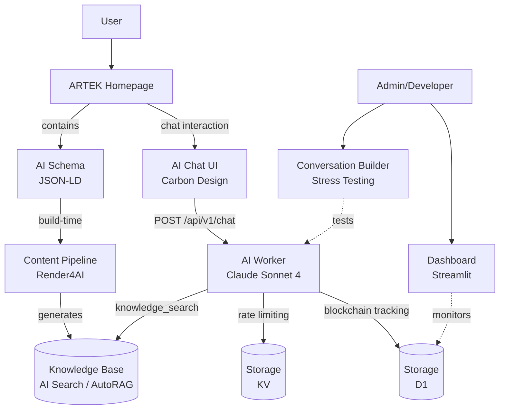
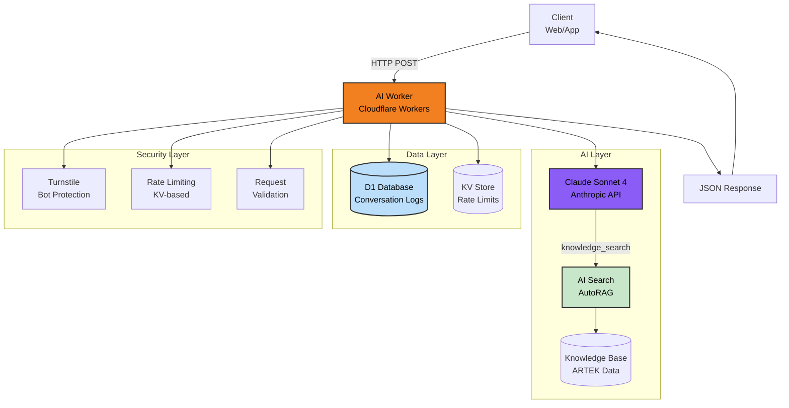
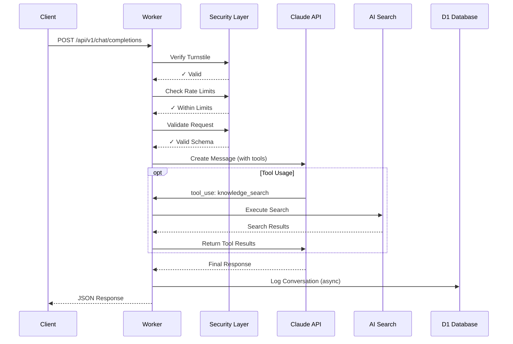

# Artek AI Worker

**ARTEK AI Worker**, kurumsal web sitemiz için geliştirilmiş, *Cloudflare Workers* platformu üzerinde çalışan bir yapay zeka sohbet botu servisidir.

*Claude Sonnet 4* dil modeli ile desteklenen sistem, *Cloudflare AI Search* entegrasyonu sayesinde web sitesinin içeriklerinden oluşan ve *Render4AI* aracı ile üretilen bilgi bankasına erişerek kullanıcı sorularına doğru ve kaynak destekli yanıtlar üretir. Bu yanıtlar ve konuşma geçmişi *Cloudflare D1* veritabanına kaydedilir.

> 🔧 **Bilgi Bankası:** Web sitesi içeriklerinden RAG knowledge base oluşturmak için `scripts/utils/render4ai` aracını kullanın. HTML içerik AI tüketimine uygun markdown formatına dönüştürülür ve AI Search'e yüklenir.

> 💡 **Analiz:** Konuşma verilerini analiz etmek için `scripts/dashboard/ai-worker` dizinindeki Streamlit dashboard'unu kullanabilirsiniz. Session görüntüleme, chain validation ve export özellikleri sunar.

> 🧪 **Stres Testi:** AI Worker'ı otomatik test etmek için `scripts/utils/dynamic-conversation-builder` aracını kullanabilirsiniz. Sadece `development`ortamında kullanabileceğiniz bu araç ile otomatik diyaloglar oluşturabilir, bilgi bankasının kalitesini test edebilirsiniz. AI vs AI ⚔️

**ARTEK AI Worker**, `ARTEK Homepage` projesinin bir parçasıdır.


## Mimari

### Genel Bakış (High-Level)



### Katmanlı Sistem Mimarisi




### İstek Akışı



---

## API

### Endpoint

```
POST /api/v1/chat/completions
```

### İstek Gövdesi

```json
{
  "messages": [
    {"role": "user", "content": "..."}
  ],
  "locale": "tr",
  "turnstileToken": "...",
  "max_tokens": 16384,
  "temperature": 0.7
}
```

### Yanıt

```json
{
  "id": "msg_...",
  "content": "...",
  "model": "claude-sonnet-4-20250514",
  "usage": {
    "input_tokens": 1234,
    "output_tokens": 567,
    "total_tokens": 1801
  }
}
```

### Hata Kodları

- **400** - Geçersiz istek / Güvenlik doğrulaması başarısız
- **404** - Endpoint bulunamadı
- **409** - Konuşma geçmişi doğrulama hatası
- **429** - İstek limiti aşıldı
- **502** - Claude API hatası
- **503** - Günlük token kotası aşıldı

---

## Test

```bash
npm test                # Tüm testler
npm run test:coverage   # Kapsam raporu
npm run test:ui         # İnteraktif test arayüzü
```

---

## Proje Yapısı

```
workers/ai-worker/
├── src/
│   ├── index.ts
│   ├── config.ts
│   ├── integrity/
│   ├── claude/
│   ├── middleware/
│   ├── validation/
│   └── tests/
├── migrations/
│   └── 0001_create_conversation_logs.sql
└── wrangler.jsonc
```

---

## İletişim

**ARTEK İnovasyon Ar-Ge Sanayi ve Tic. Ltd. Şti.**

- 🌐 [www.artek.tc](https://www.artek.tc)
- 📧 info@artek.tc

**Geliştirici:** Rıza Emre ARAS - r.emrearas@proton.me

