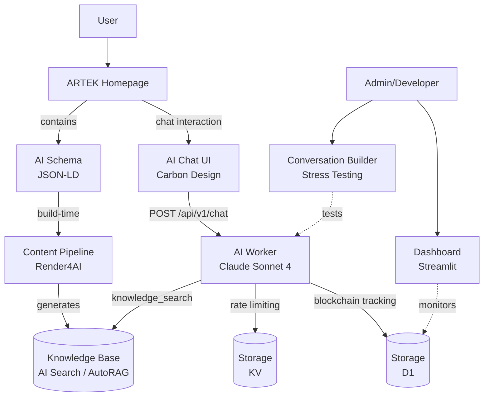
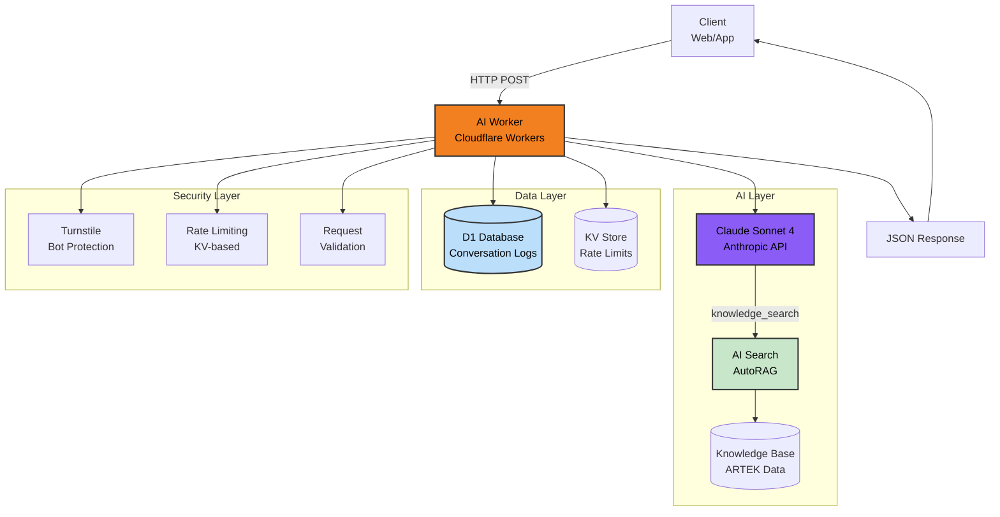
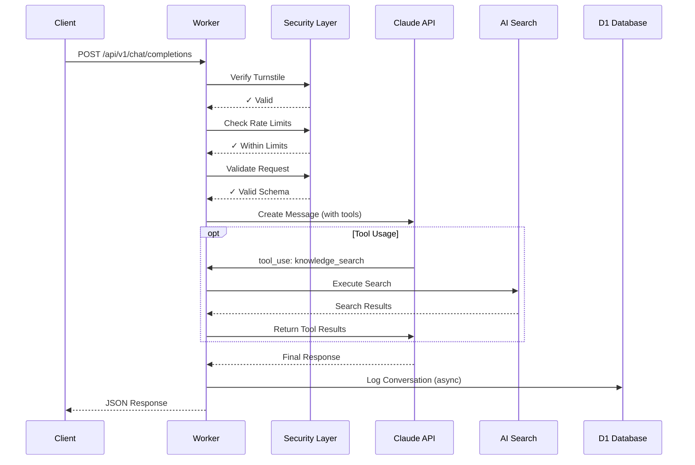

# Artek AI Worker

**ARTEK AI Worker** is an AI chatbot service developed for our corporate website, running on the *Cloudflare Workers* platform.

Powered by the *Claude Sonnet 4* language model, the system accesses a knowledge base generated from website content by the *Render4AI* tool through *Cloudflare AI Search* integration, producing accurate and source-backed answers to user queries. These responses and conversation history are stored in the *Cloudflare D1* database.

> 🔧 **Knowledge Base:** Use the `scripts/utils/render4ai` tool to create or update the RAG knowledge base from website content. HTML content is converted to AI-optimized markdown format and uploaded to AI Search.

> 💡 **Analysis:** Use the Streamlit dashboard in the `scripts/dashboard/ai-worker` directory to analyze conversation data. Features include session viewing, chain validation, and export capabilities.

> 🧪 **Stress Test:** Use the `scripts/utils/dynamic-conversation-builder` tool to automatically test the AI Worker. This tool, available only in `development` environment, creates automated dialogues and tests knowledge base quality. AI vs AI ⚔️

**ARTEK AI Worker** is part of the `ARTEK Homepage` project.


## Architecture

### Overview (High-Level)



### Layered System Architecture




### Request Flow



---

## API

### Endpoint

```
POST /api/v1/chat/completions
```

### Request Body

```json
{
  "messages": [
    {"role": "user", "content": "..."}
  ],
  "locale": "tr",
  "turnstileToken": "...",
  "max_tokens": 16384,
  "temperature": 0.7
}
```

### Response

```json
{
  "id": "msg_...",
  "content": "...",
  "model": "claude-sonnet-4-20250514",
  "usage": {
    "input_tokens": 1234,
    "output_tokens": 567,
    "total_tokens": 1801
  }
}
```

### Error Codes

- **400** - Invalid request / Security verification failed
- **404** - Endpoint not found
- **409** - Conversation history validation error
- **429** - Request limit exceeded
- **502** - Claude API error
- **503** - Daily token quota exceeded

---

## Testing

```bash
npm test                # All tests
npm run test:coverage   # Coverage report
npm run test:ui         # Interactive test UI
```

---

## Project Structure

```
workers/ai-worker/
├── src/
│   ├── index.ts
│   ├── config.ts
│   ├── integrity/
│   ├── claude/
│   ├── middleware/
│   ├── validation/
│   └── tests/
├── migrations/
│   └── 0001_create_conversation_logs.sql
└── wrangler.jsonc
```

---

## Contact

**ARTEK İnovasyon Ar-Ge Sanayi ve Tic. Ltd. Şti.**

- 🌐 [www.artek.tc](https://www.artek.tc)
- 📧 info@artek.tc

**Developer:** Rıza Emre ARAS - r.emrearas@proton.me