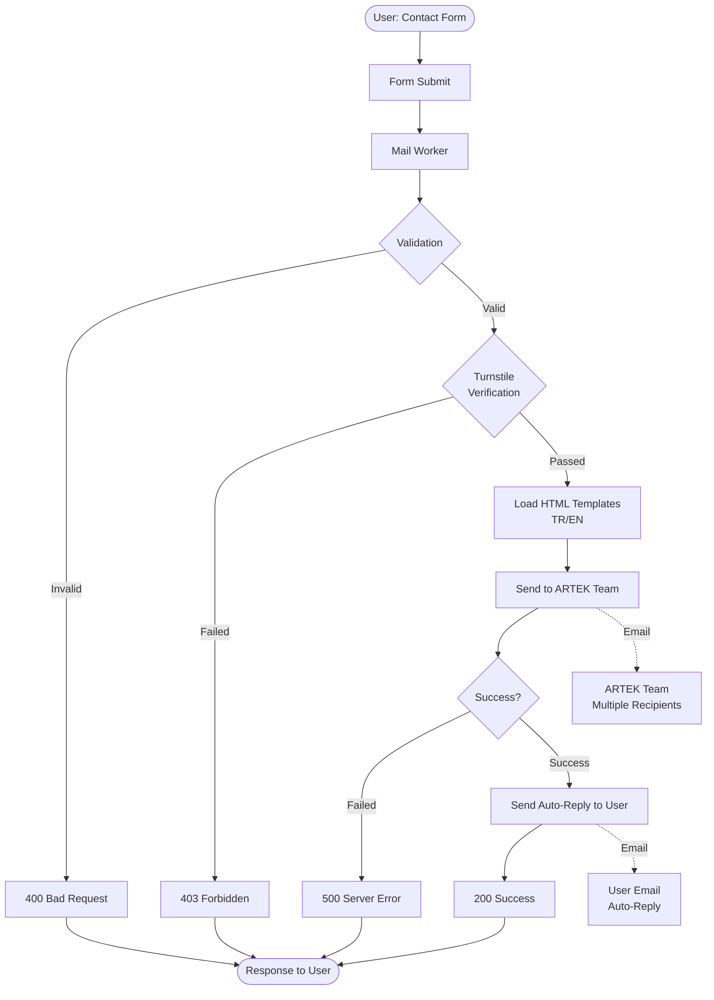

# Artek Mail Worker

**ARTEK Mail Worker**, kurumsal web sitemiz için geliştirilmiş, *Cloudflare Workers* platformu üzerinde çalışan sunucusuz bir iletişim formu e-posta servisidir.

*Resend* ile entegre olan sistem, *Cloudflare Turnstile* bot koruması sayesinde güvenli form gönderimi sağlar. Kullanıcılardan gelen mesajları profesyonel HTML e-posta şablonları ile hem ARTEK ekibine hem de kullanıcıya (otomatik yanıt) gönderir. İki dilli (TR/EN) destek sunar.

> 🔒 **Güvenlik:** Turnstile bot koruması ile spam ve bot saldırılarına karşı koruma sağlar.

> 🌍 **Çok Dilli:** Türkçe ve İngilizce dil desteği ile hem validation mesajları hem de e-posta şablonları otomatik olarak kullanıcının diline göre ayarlanır.

> 📧 **İki Yönlü E-posta:** Hem ARTEK ekibine bildirim gönderir (reply-to özelliği ile) hem de kullanıcıya otomatik yanıt e-postası gönderir.

**ARTEK Mail Worker**, `ARTEK Homepage` projesinin bir parçasıdır.


## Mimari



---

## API

### Endpoint

```
POST /send
```

### İstek Gövdesi

```json
{
  "name": "Ahmet Yılmaz",
  "email": "ahmet@example.com",
  "phone": "+90 555 123 4567",
  "company": "Example A.Ş.",
  "subject": "Ürün Bilgisi Talebi",
  "message": "Merhaba, ürünleriniz hakkında detaylı bilgi almak istiyorum...",
  "turnstileToken": "0.abc123...",
  "locale": "tr"
}
```

#### Zorunlu Alanlar
- `name` (string, min: 2 karakter)
- `email` (string, geçerli e-posta formatı)
- `subject` (string, min: 3 karakter)
- `message` (string, min: 10 karakter)
- `turnstileToken` (string)
- `locale` (string: "tr" | "en")

#### İsteğe Bağlı Alanlar
- `phone` (string)
- `company` (string)

### Başarılı Yanıt

```json
{
  "success": true,
  "message": "Mesajınız başarıyla gönderildi. En kısa sürede size dönüş yapacağız."
}
```

**HTTP Status:** `200 OK`

### Hata Yanıtları

#### Validation Hatası
```json
{
  "error": "Ad Soyad en az 2 karakter olmalıdır"
}
```
**HTTP Status:** `400 Bad Request`

#### Güvenlik Doğrulama Hatası
```json
{
  "error": "Güvenlik doğrulaması başarısız oldu."
}
```
**HTTP Status:** `403 Forbidden`

#### Sunucu Hatası
```json
{
  "error": "Email gönderilemedi. Lütfen daha sonra tekrar deneyin."
}
```
**HTTP Status:** `500 Internal Server Error`

### Hata Kodları

- **400** - Geçersiz istek / Validation hatası
- **403** - Turnstile güvenlik doğrulaması başarısız
- **405** - Method not allowed (sadece POST desteklenir)
- **500** - E-posta gönderme hatası / Sunucu hatası

---

## E-posta Şablonları

Sistem iki farklı e-posta şablonu kullanır ve her ikisi de Türkçe/İngilizce dil desteğine sahiptir:

### 1. İletişim Bildirimi (ARTEK Ekibine)
- **Dosya:** `src/templates/{locale}/contact-notification.html`
- **Alıcı:** ARTEK ekip üyeleri (çoklu alıcı desteği)
- **Reply-To:** Kullanıcının e-posta adresi (direkt yanıt için)
- **Konu:** `[ARTEK Contact] {kullanıcının konusu}`

### 2. Otomatik Yanıt (Kullanıcıya)
- **Dosya:** `src/templates/{locale}/auto-reply.html`
- **Alıcı:** Form gönderen kullanıcı
- **Konu:** `Mesajınız Alındı - ARTEK` (TR) / `Your Message Received - ARTEK` (EN)

**Şablon Yapısı:**
```
src/templates/
├── tr/
│   ├── contact-notification.html
│   └── auto-reply.html
└── en/
    ├── contact-notification.html
    └── auto-reply.html
```

---

## Yapılandırma

### Environment Variables

#### Development (.dev.vars)

```bash
ENVIRONMENT=development
RESEND_API_KEY=re_123456789_YourTestApiKeyHere
TURNSTILE_SECRET_KEY=1x0000000000000000000000000000000AA
RECIPIENT_EMAILS=delivered+recipient1@resend.dev,delivered+recipient2@resend.dev
```

#### Production (Wrangler Secrets)

```bash
# Production secrets'ları CLI ile ayarlayın
npx wrangler secret put RESEND_API_KEY
npx wrangler secret put TURNSTILE_SECRET_KEY
npx wrangler secret put RECIPIENT_EMAILS
```

**Not:** Production'da `RECIPIENT_EMAILS` gerçek e-posta adreslerini içermelidir (virgülle ayrılmış):
```
info@artek.tc,support@artek.tc,sales@artek.tc
```

### Statik Yapılandırma

**Dosya:** `src/config.ts`

```typescript
export const CONFIG = {
  email: {
    fromAddress: 'contactform@notifications.artek.tc',
    fromNameContactForm: 'ARTEK Contact Form',
    fromNameAutoReply: 'ARTEK',
    subjectPrefix: '[ARTEK Contact]',
    devAutoReplyEmail: 'delivered+auto-reply@resend.dev',
  },
} as const;
```

### Development Mode Özellikleri

Development ortamında güvenli test için:

1. **Auto-Reply Yönlendirme:** Gerçek kullanıcılara e-posta gönderilmez, Resend test adresine yönlendirilir
2. **Verbose Logging:** Detaylı hata logları ve stack trace
3. **Test E-postaları:** `delivered@resend.dev` domain'i ile test

```typescript
const autoReplyRecipient =
  env.ENVIRONMENT === 'development'
    ? CONFIG.email.devAutoReplyEmail  // Test address
    : data.email;                      // Real user email
```

---

## Proje Yapısı

```
workers/mail-worker/
├── src/
│   ├── index.ts
│   ├── config.ts
│   ├── types.ts
│   ├── templates.ts
│   ├── translations.ts
│   ├── html.d.ts
│   ├── templates/
│   │   ├── tr/
│   │   │   ├── contact-notification.html
│   │   │   └── auto-reply.html
│   │   └── en/
│   │       ├── contact-notification.html
│   │       └── auto-reply.html
│   └── utils/
│       └── logging.ts
├── .dev.vars.example
├── wrangler.jsonc
├── tsconfig.json
├── package.json
└── README.md
```

---

## İletişim

**ARTEK İnovasyon Ar-Ge Sanayi ve Tic. Ltd. Şti.**

- 🌐 [www.artek.tc](https://www.artek.tc)
- 📧 info@artek.tc

**Geliştirici:** Rıza Emre ARAS - r.emrearas@proton.me
