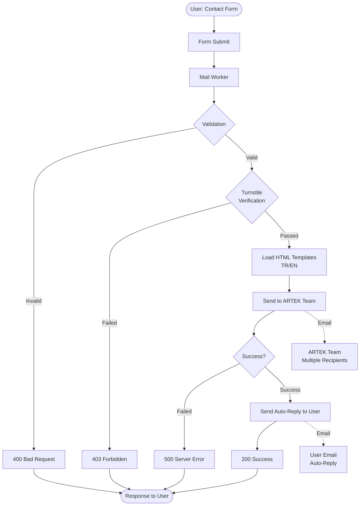

# Artek Mail Worker

**ARTEK Mail Worker** is a serverless contact form email service developed for our corporate website, running on the *Cloudflare Workers* platform.

Integrated with *Resend*, the system ensures secure form submissions through *Cloudflare Turnstile* bot protection. It sends user messages via professional HTML email templates to both the ARTEK team and the user (auto-reply). Supports bilingual (TR/EN) functionality.

> 🔒 **Security:** Provides protection against spam and bot attacks with Turnstile bot protection.

> 🌍 **Multilingual:** Both validation messages and email templates are automatically adjusted according to the user's language with Turkish and English language support.

> 📧 **Two-Way Email:** Sends notifications to the ARTEK team (with reply-to feature) and sends an auto-reply email to the user.

**ARTEK Mail Worker** is part of the `ARTEK Homepage` project.


## Architecture



---

## API

### Endpoint

```
POST /send
```

### Request Body

```json
{
  "name": "John Doe",
  "email": "john@example.com",
  "phone": "+1 555 123 4567",
  "company": "Example Inc.",
  "subject": "Product Information Request",
  "message": "Hello, I would like to get detailed information about your products...",
  "turnstileToken": "0.abc123...",
  "locale": "en"
}
```

#### Required Fields
- `name` (string, min: 2 characters)
- `email` (string, valid email format)
- `subject` (string, min: 3 characters)
- `message` (string, min: 10 characters)
- `turnstileToken` (string)
- `locale` (string: "tr" | "en")

#### Optional Fields
- `phone` (string)
- `company` (string)

### Success Response

```json
{
  "success": true,
  "message": "Your message has been sent successfully. We will get back to you soon."
}
```

**HTTP Status:** `200 OK`

### Error Responses

#### Validation Error
```json
{
  "error": "Name must be at least 2 characters"
}
```
**HTTP Status:** `400 Bad Request`

#### Security Verification Error
```json
{
  "error": "Security verification failed."
}
```
**HTTP Status:** `403 Forbidden`

#### Server Error
```json
{
  "error": "Failed to send email. Please try again later."
}
```
**HTTP Status:** `500 Internal Server Error`

### Error Codes

- **400** - Invalid request / Validation error
- **403** - Turnstile security verification failed
- **405** - Method not allowed (only POST is supported)
- **500** - Email sending error / Server error

---

## Email Templates

The system uses two different email templates, both supporting Turkish/English languages:

### 1. Contact Notification (To ARTEK Team)
- **File:** `src/templates/{locale}/contact-notification.html`
- **Recipient:** ARTEK team members (multiple recipients support)
- **Reply-To:** User's email address (for direct reply)
- **Subject:** `[ARTEK Contact] {user's subject}`

### 2. Auto-Reply (To User)
- **File:** `src/templates/{locale}/auto-reply.html`
- **Recipient:** Form submitting user
- **Subject:** `Mesajınız Alındı - ARTEK` (TR) / `Your Message Received - ARTEK` (EN)

**Template Structure:**
```
src/templates/
├── tr/
│   ├── contact-notification.html
│   └── auto-reply.html
└── en/
    ├── contact-notification.html
    └── auto-reply.html
```

---

## Configuration

### Environment Variables

#### Development (.dev.vars)

```bash
ENVIRONMENT=development
RESEND_API_KEY=re_123456789_YourTestApiKeyHere
TURNSTILE_SECRET_KEY=1x0000000000000000000000000000000AA
RECIPIENT_EMAILS=delivered+recipient1@resend.dev,delivered+recipient2@resend.dev
```

#### Production (Wrangler Secrets)

```bash
# Set production secrets via CLI
npx wrangler secret put RESEND_API_KEY
npx wrangler secret put TURNSTILE_SECRET_KEY
npx wrangler secret put RECIPIENT_EMAILS
```

**Note:** In production, `RECIPIENT_EMAILS` must contain real email addresses (comma-separated):
```
info@artek.tc,support@artek.tc,sales@artek.tc
```

### Static Configuration

**File:** `src/config.ts`

```typescript
export const CONFIG = {
  email: {
    fromAddress: 'contactform@notifications.artek.tc',
    fromNameContactForm: 'ARTEK Contact Form',
    fromNameAutoReply: 'ARTEK',
    subjectPrefix: '[ARTEK Contact]',
    devAutoReplyEmail: 'delivered+auto-reply@resend.dev',
  },
} as const;
```

### Development Mode Features

For safe testing in development environment:

1. **Auto-Reply Redirect:** No emails are sent to real users, redirected to Resend test address
2. **Verbose Logging:** Detailed error logs and stack trace
3. **Test Emails:** Testing with `delivered@resend.dev` domain

```typescript
const autoReplyRecipient =
  env.ENVIRONMENT === 'development'
    ? CONFIG.email.devAutoReplyEmail  // Test address
    : data.email;                      // Real user email
```

---

## Project Structure

```
workers/mail-worker/
├── src/
│   ├── index.ts
│   ├── config.ts
│   ├── types.ts
│   ├── templates.ts
│   ├── translations.ts
│   ├── html.d.ts
│   ├── templates/
│   │   ├── tr/
│   │   │   ├── contact-notification.html
│   │   │   └── auto-reply.html
│   │   └── en/
│   │       ├── contact-notification.html
│   │       └── auto-reply.html
│   └── utils/
│       └── logging.ts
├── .dev.vars.example
├── wrangler.jsonc
├── tsconfig.json
├── package.json
└── README.md
```

---

## Contact

**ARTEK İnovasyon Ar-Ge Sanayi ve Tic. Ltd. Şti.**

- 🌐 [www.artek.tc](https://www.artek.tc)
- 📧 info@artek.tc

**Developer:** Rıza Emre ARAS - r.emrearas@proton.me